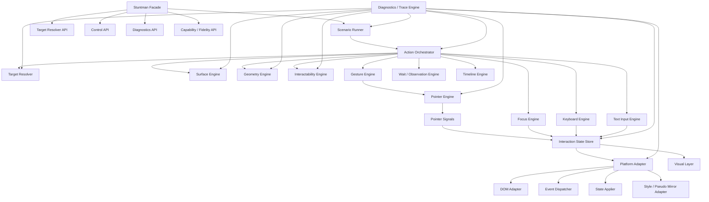
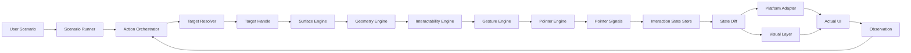
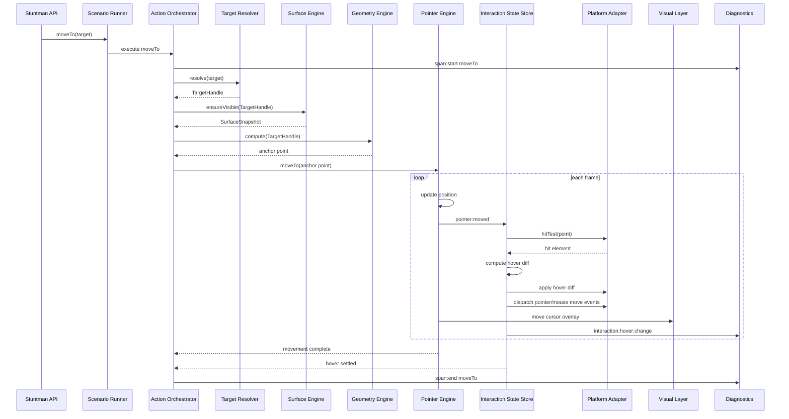
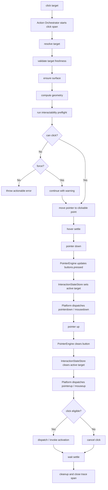
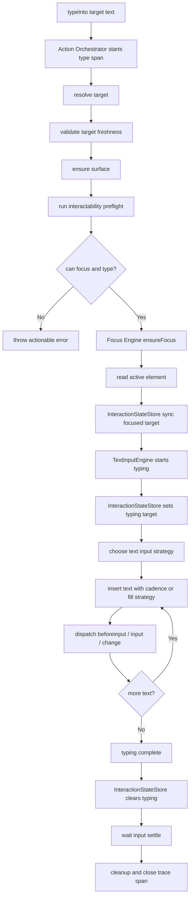
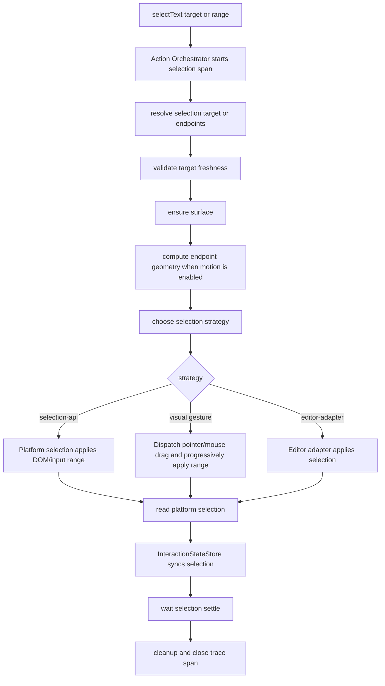

# stuntman/browser 구현체 설계

## 1. 전체 구조



핵심 흐름은 다음과 같습니다.

```txt
Scenario
→ Scenario Runner
→ Action Orchestrator
→ Target / Surface / Geometry / Interactability
→ Gesture / Pointer / Focus / Keyboard / Text Input
→ Interaction State Store
→ Platform Adapter / Visual Layer
→ Wait / Observation
```

---

## 2. 설계 변경 요약

v0.2에서 v0.3으로 넘어오며 다음 구조를 반영합니다.

```txt
Action Planner
→ Action Orchestrator로 대체

Geometry Engine
→ 순수 공간 계산에 집중

Interactability Engine
→ 조작 가능성 판단을 별도 엔진으로 분리

Interaction State Engine
→ Interaction State Store + slices 구조로 변경

Pseudo State Mirror
→ core correctness가 아니라 best-effort visual feature로 정의

Diagnostics / Trace
→ 단순 event log가 아니라 span 기반 trace로 강화

Platform Adapter
→ DOM / Event / State / Style 하위 adapter로 분리

Public API
→ type / typeInto / fill 구분
→ click(target) / clickCurrent() 구분
→ selectText는 drag와 별도 intent로 구분
→ raw pointer primitive는 pointerSequence transaction 또는 advanced device namespace로 분리
```

---

## 3. Stuntman Facade

사용자가 직접 만나는 API 계층입니다.

```ts
const stuntman = new Stuntman({
  feedback: 'debug',
  motion: true,
})

await stuntman.click(role('button', { name: 'Create Project' }))
await stuntman.typeInto(label('Project name'), 'stuntman')
```

담당:

```txt
- public API 제공
- run / pause / resume / stop / destroy
- resolve / resolveAll / exists / inspect 제공
- geometry API 제공
- capability / fidelity 정보 노출
- diagnostics / trace API 노출
- 내부 엔진 orchestration 진입점
```

최종 public API 초안:

```ts
class Stuntman {
  resolve(locator: Locator, options?: ResolveOptions): Promise<TargetHandle>
  resolveAll(locator: Locator, options?: ResolveOptions): Promise<TargetHandle[]>
  exists(locator: Locator, options?: ResolveOptions): Promise<boolean>
  inspect(target: TargetLike): Promise<TargetInspection>

  geometry(target: TargetLike): Promise<GeometrySnapshot>

  moveTo(target: TargetLike, options?: MoveOptions): Promise<void>
  click(target: TargetLike, options?: ClickOptions): Promise<void>
  clickCurrent(options?: ClickCurrentOptions): Promise<void>
  doubleClick(target: TargetLike, options?: ClickOptions): Promise<void>

  focus(target: TargetLike, options?: FocusOptions): Promise<void>
  type(text: string, options?: TypeOptions): Promise<void>
  typeInto(target: TargetLike, text: string, options?: TypeOptions): Promise<void>
  fill(target: TargetLike, text: string, options?: FillOptions): Promise<void>
  press(keys: string, options?: PressOptions): Promise<void>

  reveal(target: TargetLike, options?: RevealOptions): Promise<RevealResult>
  scrollTo(position: ScrollPosition, options?: ScrollOptions): Promise<ScrollResult>
  scrollBy(delta: ScrollDelta, options?: ScrollOptions): Promise<ScrollResult>
  drag(from: TargetLike, to: TargetLike, options?: DragOptions): Promise<void>
  selectText(targetOrRange: TextSelectionTarget, options?: SelectTextOptions): Promise<void>
  pointerSequence(sequence: PointerSequence, options?: PointerSequenceOptions): Promise<void>

  waitFor(condition: WaitCondition, options?: WaitOptions): Promise<void>

  run(scenario: Scenario, options?: RunOptions): Promise<void>
  pause(): void
  resume(): void
  stop(): void
  destroy(): void

  getCapabilities(): CapabilityReport
  getFidelity(): FidelityReport
  getTrace(): Trace

  on(event: DebugEventName, listener: Listener): void
  off(event: DebugEventName, listener: Listener): void
}
```

### Text selection and pointer control

Decision history:
`docs/adr/2026-06-19-text-selection-and-pointer-sequence.md`,
`docs/adr/2026-06-22-select-text-visual-gesture.md`.

`selectText` is a user-intent action, not a drag alias. It changes the current
document, input, textarea, contenteditable, or editor selection range. The
browser implementation must prove the endpoint model with a PoC before the API
is treated as stable across all editable surfaces.

```ts
type TextSelectionTarget =
  | TargetLike
  | {
      anchor: TextSelectionEndpoint
      focus: TextSelectionEndpoint
    }

type TextSelectionEndpoint = {
  target: TargetLike
  offset?: number
  point?: Point
}

type SelectTextOptions = OperationOptions & PointerMovementOptions
```

`selectText` remains a selection intent action. With the default motion policy,
the browser runtime performs a cleanup-safe selection visual gesture: it
dispatches the synthetic pointer/mouse down, move, and up events that a human
drag selection would produce, shows a pressed text cursor moving from anchor to
the current selection focus, and progressively applies the Selection API or
input range so selected text grows during the gesture. `duration` and `motion`
options tune this gesture, while `motion: false` or `duration: 0` keeps the
fast immediate selection path. It does not dispatch a `click` activation for a
drag selection. Synthetic pointer events alone do not reliably create native
browser selection, so the Action Orchestrator owns both event dispatch and range
application inside the same transaction.

`pointerDown`, `pointerMove`, and `pointerUp` are state-opening device
primitives. They may exist internally and may be exposed later under an
advanced device-control namespace, but recorder output and scenario playback
should not model them as independent portable actions. When low-level replay is
needed, it must be represented as one `pointerSequence` action so the Action
Orchestrator owns timeout, cancellation, trace, pointer-up/pointer-cancel
cleanup, and interaction-state cleanup.

```ts
type PointerSequence = readonly PointerSequenceStep[]

type PointerSequenceStep =
  | { type: 'move'; to: Point; duration?: DurationMs }
  | { type: 'down'; button?: PointerButtonName }
  | { type: 'up'; button?: PointerButtonName }
  | { type: 'pause'; duration: DurationMs }
```

### Browser option model

Browser options are normalized by a dedicated option module before runtime
execution reaches the lower-level engines.

Decision history: `docs/adr/2026-06-17-browser-options-model.md`.

```txt
src/options/
- owns browser option defaults
- normalizes public options into internal option policy
- resolves runner-level action defaults
- resolves motion-enabled / motion-disabled behavior
- materializes final action options by merging step/call overrides
```

The browser facade should avoid overlapping `mode` and `visual` flags. The
current design direction is to replace them with an intent-oriented feedback
surface:

```ts
type ActorbleFeedback =
  | 'off'
  | 'cursor'
  | 'debug'
  | {
      cursor?: boolean
      target?: boolean
      click?: boolean
      focus?: boolean
      typing?: boolean
      keystroke?: boolean
      text?: 'hidden' | 'masked' | 'plain'
    }
```

Motion is a separate runtime policy because visual feedback and movement timing
are related but not identical concerns.

```ts
type RunOptions = OperationOptions & {
  motion?: boolean
  actionDefaults?: {
    click?: Partial<ClickOptions>
    moveTo?: Partial<MoveOptions>
    typeInto?: Partial<TypeOptions>
    press?: Partial<PressOptions>
    drag?: Partial<DragOptions>
    selectText?: Partial<SelectTextOptions>
    pointerSequence?: Partial<PointerSequenceOptions>
  }
}
```

Merge order:

```txt
1. centralized browser defaults
2. actorble-level defaults
3. runner-level motion policy
4. runner-level actionDefaults[action]
5. scenario step options or direct call options
```

Step/call options always win. Runner-level motion can disable pointer motion
globally while still allowing action execution.

Pointer motion profiles:

```ts
type PointerMotionProfile =
  | { kind: 'ease'; timing?: 'linear' | 'ease-in' | 'ease-out' | 'ease-in-out'; duration?: DurationMs }
  | { kind: 'inertia'; initialVelocity?: number; deceleration?: number }
  | { kind: 'spring'; stiffness?: number; damping?: number; mass?: number }
```

`linear` is not a separate motion kind. It is represented as an `ease` timing
function. `inertia` and `spring` do not accept `duration`; their implementation
must be planned as follow-up tasks because they need physically meaningful
parameters and settlement rules.

---

## 4. Scenario Runner

Scenario Runner는 선언형 scenario를 순서대로 실행하는 계층입니다.

담당:

```txt
- scenario 시작 / 종료 관리
- step 순서 관리
- pause / resume / stop 상태 관리
- scenario-level timeout / cancellation 관리
- step 실행을 Action Orchestrator에 위임
- scenario trace span 생성
```

Scenario Runner는 개별 action의 내부 lifecycle을 직접 수행하지 않습니다.

```txt
Scenario Runner
= scenario 전체 흐름 관리

Action Orchestrator
= 개별 action transaction 관리
```

---

## 5. Action Orchestrator

기존 `Action Planner`를 대체하는 핵심 실행 계층입니다.

Action Orchestrator는 `click`, `moveTo`, `typeInto`, `drag`, `selectText` 같은 user-intent action과 `pointerSequence` 같은 transactional device action을 안전한 lifecycle로 실행합니다.

담당:

```txt
- action lifecycle 관리
- resolve / reveal / geometry / preflight / perform / wait / cleanup
- cancellation-safe cleanup
- retry policy
- timeout policy
- force option 처리
- action-level trace span 생성
```

예를 들어 `click(target)`은 단일 action처럼 보이지만 내부적으로는 다음 transaction입니다.

```txt
1. resolve target
2. validate target freshness
3. ensure target surface
4. reveal target if needed
5. compute geometry
6. run interactability preflight
7. move pointer to clickable point
8. settle hover
9. pointer down
10. active state apply
11. pointer up
12. active state clear
13. dispatch / invoke activation
14. wait for settlement
15. cleanup
```

Action Orchestrator가 책임지는 실패/중단 처리:

```txt
- action 도중 target이 stale해진 경우
- pointer down 이후 cancel된 경우 pointer up cleanup 보장
- wait timeout 발생 시 active/hover/visual state 정리
- force click 허용 여부
- 실패 시 trace span과 actionable error context 생성
```

Public action boundary는 기본적으로 cleanup-safe해야 합니다. `pointerDown`,
`pointerMove`, `pointerUp` 같은 low-level primitive는 호출이 끝나도 pressed,
active, pointer capture 같은 열린 상태를 남길 수 있으므로 기본 scenario step으로
노출하지 않습니다. Low-level replay가 필요하면 `pointerSequence`를 하나의 Action
Orchestrator transaction으로 실행하고, 실패/중단 시 pointer up 또는 pointer cancel과
Interaction State cleanup을 보장합니다.

---

## 6. Target Resolver

**무엇을 조작할지 찾는 엔진**입니다.
외부 API로 노출합니다.

```ts
const button = await stuntman.resolve(
  role('button', { name: 'Create Project' })
)

const candidates = await stuntman.resolveAll(text('Create'))
```

담당:

```txt
- css / role / text / label / testId / point / element locator 처리
- 후보 ranking
- ambiguous target 감지
- strict mode 지원
- target debug info 생성
- stale target 검증
- waitFor와 연동
```

추천 API:

```ts
stuntman.resolve(locator, options?)
stuntman.resolveAll(locator, options?)
stuntman.exists(locator, options?)
stuntman.inspect(target)
```

`TargetHandle`은 영구 참조가 아니라 짧게 유효한 snapshot handle입니다.

```ts
type TargetHandle = {
  id: string
  element: Element
  locator?: Locator
  resolvedAt: number
  root: Document | ShadowRoot
  surfaceId?: string
  validity: 'live' | 'stale' | 'detached' | 'unknown'
  debug: TargetDebugInfo
}
```

모든 action 직전에는 TargetHandle을 검증합니다.

```txt
validate target
→ live면 그대로 사용
→ stale이면 locator로 재resolve
→ 실패하면 TARGET_STALE 또는 TARGET_NOT_FOUND
```

Resolve 옵션:

```ts
type ResolveOptions = {
  strict?: boolean
  timeout?: number
}
```

strict 정책:

```txt
strict: true
- 후보 0개 → TARGET_NOT_FOUND
- 후보 2개 이상 → TARGET_AMBIGUOUS

strict: false
- ranking으로 best candidate 선택
- trace에 candidate list 기록
```

---

## 7. Surface Engine

**어느 공간에서 조작하는지 관리하는 엔진**입니다.

브라우저에서 surface는 단순 viewport만이 아닙니다.

```txt
- top-level viewport
- scroll container
- iframe viewport
- shadow root boundary
- dialog
- popover
- modal
- fixed layer
```

담당:

```txt
- active surface 관리
- surface root 확인
- scroll container chain 계산
- target을 보이게 만들기
- viewport / document / iframe / shadow root 좌표 변환
- clipping chain 원천 데이터 제공
- target이 현재 surface에 속하는지 판단
```

`ScrollEngine`은 별도 최상위 엔진으로 두지 않고 Surface Engine의 하위 책임으로 둡니다.

```ts
class SurfaceEngine {
  getSurfaceFor(target: TargetHandle): SurfaceSnapshot
  getScrollableAncestors(target: TargetHandle): readonly Element[]
  reveal(target: TargetHandle, options?: RevealOptions): Promise<RevealResult>
  scrollTo(position: ScrollPosition, options?: ScrollOptions): Promise<ScrollResult>
  scrollBy(delta: ScrollDelta, options?: ScrollOptions): Promise<ScrollResult>
  mapPoint(point: Point, from: CoordinateSpace, to: CoordinateSpace): Point
}
```

Decision history: `docs/adr/2026-07-14-browser-reveal-stability-runtime.md`.

`reveal`, `scrollTo`, and `scrollBy` are distinct user intents.

```txt
reveal(target)
= target visibility를 만족하도록 필요한 scroll surface만 이동

scrollTo(position)
= viewport 또는 explicit surface를 절대 좌표로 이동

scrollBy(delta)
= viewport 또는 explicit surface를 상대 좌표만큼 이동
```

기존 `scrollTo(target)` overload는 migration 기간의 deprecated alias이며 내부적으로
`reveal(target)`에 위임합니다. 새 scenario schema와 facade overload는 position 기반
`scrollTo`만 생성합니다.

Surface Engine의 public architecture boundary는 유지하되 내부 책임은 다음처럼 나눕니다.

```txt
targeting/surface-engine/
  -> public surface boundary and composition

targeting/scroll-chain-resolver/
  -> target에서 inner-to-outer scroll surface chain 계산

targeting/reveal-planner/
  -> visibility requirement와 alignment를 scroll step으로 계획

targeting/scroll-settlement-observer/
  -> native scrollend와 offset/quiet-window fallback 관찰
```

Scroll chain traversal은 `parentElement`에서 끝나지 않고 open shadow root의 host를 따라갑니다.
Cross-origin iframe과 closed shadow root는 현재 non-goal이며 capability/fidelity limitation으로
보고합니다.

Reveal planning은 raw viewport가 아니라 다음 effective viewport를 사용합니다.

```txt
container viewport
- CSS scroll-padding
- caller-provided safeArea
= effective viewport
```

Target의 CSS scroll-margin, requested block/inline alignment, scroll range clamp를 적용합니다.
계획은 inner-to-outer 순서로 실행하며 각 step 뒤 geometry cache invalidation을 반영하고 다음
surface delta를 재계산합니다. Oversized target은 가능한 최대 visibility를 확보하고
`fullyVisible: false`를 반환하지만 reveal action 자체를 실패시키지 않습니다.

```ts
type RevealResult = Readonly<{
  target: TargetHandle
  changed: boolean
  before: VisibilitySnapshot
  after: VisibilitySnapshot
  fullyVisible: boolean
  visibilityRatio: number
  steps: readonly RevealExecutionStep[]
}>
```

Scroll motion은 `instant`, `native-smooth`, `timed`를 구분합니다. `instant`가 기본이며,
`timed`는 Timeline Engine의 frame scheduling을 재사용합니다. 모든 mode는 동일한
`AbortSignal`을 따르고 cancellation 시 현재 scroll position을 보존한 채 future frames와
observer만 정리합니다.

Surface Engine과 Geometry Engine의 경계:

```txt
Surface Engine
- 어디에서 볼 것인가
- 어떤 surface에 속하는가
- 어떤 좌표계를 사용하는가
- 어떤 scroll/reveal 경로가 있는가

Geometry Engine
- 실제 rect가 어디인가
- visible rect가 얼마인가
- pointer anchor point는 어디인가
```

---

## 8. Geometry Engine

**target이 어디에 있고, 어디를 향해 움직여야 하는지 계산하는 엔진**입니다.

담당:

```txt
- bounding rect 계산
- visible rect 계산
- center point 계산
- clickable point 후보 계산
- coordinate space 정규화
- pointer가 이동할 anchor point 계산
```

Geometry Engine은 조작 가능성 자체를 최종 판단하지 않습니다.

```txt
Geometry Engine
= 공간 계산

Interactability Engine
= 조작 가능성 판단
```

Geometry snapshot:

```ts
type GeometrySnapshot = {
  target: TargetHandle

  rect: Rect
  visibleRect: Rect | null
  center: Point

  clickablePoint: ClickablePointResult

  coordinateSpace: CoordinateSpace
  computedAt: number
}
```

`clickablePoint`는 단순 `Point | null`이 아니라 계산 근거를 포함해야 합니다.

```ts
type ClickablePointResult =
  | {
      ok: true
      point: Point
      strategy:
        | 'center'
        | 'visible-center'
        | 'grid-sampling'
        | 'label-control'
        | 'custom'
      hitElement?: Element
    }
  | {
      ok: false
      reason:
        | 'not-visible'
        | 'fully-occluded'
        | 'pointer-events-none'
        | 'disabled'
        | 'outside-surface'
        | 'no-sample-hit'
      samples?: PointSample[]
    }
```

---

## 9. Interactability Engine

**target이 지금 실제로 조작 가능한지 판단하는 엔진**입니다.

Geometry가 “어디에 있는가”를 계산한다면, Interactability는 “지금 조작해도 되는가”를 판단합니다.

담당:

```txt
- visible enough 판단
- enabled / disabled 판단
- readonly / editable 판단
- pointer-events 판단
- inert 판단
- aria-disabled 판단
- occlusion 판단
- receives pointer events 판단
- focusable 여부 판단
- editable 여부 판단
- force option으로 우회 가능한지 판단
```

예시 타입:

```ts
type InteractabilityReport = {
  target: TargetHandle

  visible: boolean
  visibilityRatio?: number

  enabled: boolean
  editable?: boolean
  focusable?: boolean

  receivesPointerEvents: boolean
  occludedBy?: TargetDebugInfo

  canClick: boolean
  canFocus: boolean
  canType?: boolean

  blockingReasons: InteractabilityReason[]
}
```

예상 실패 메시지:

```txt
Cannot click "Create Project".
The element is visible, but its clickable point is covered by ".loading-overlay".
```

Action Orchestrator는 action 수행 전 Interactability Engine의 preflight를 통과해야 합니다.

```txt
click
→ canClick preflight

focus
→ canFocus preflight

typeInto
→ canFocus + canType preflight
```

---

## 10. Gesture Engine

Gesture Engine은 pointer 기반 composite action을 담당합니다.

담당:

```txt
- click
- doubleClick
- longPress
- drag
- hover settle
- text selection gesture
- pointer sequence
```

Gesture Engine은 Pointer Engine을 사용하지만, Pointer Engine 자체는 아닙니다.

```txt
Pointer Engine
- 좌표와 버튼 상태를 관리

Gesture Engine
- pointer signal을 조합해 click, drag 같은 고수준 제스처를 구성
```

`click(target)`은 Action Orchestrator가 lifecycle을 관리하고, 실제 pointer down/up sequence는 Gesture Engine이 수행합니다.

Text selection은 pointer drag와 같은 signal sequence를 사용할 수 있지만 drag로
정규화하지 않습니다. `drag`는 source와 drop destination 사이의 이동 intent이고,
`selectText`는 selection anchor/focus/range를 변경하는 intent입니다.

Drag는 capability 기반으로 관리합니다.

```ts
type DragCapability =
  | 'none'
  | 'pointer-gesture'
  | 'html5-dnd'
  | 'custom-adapter'
```

Text selection은 별도 capability로 관리합니다.

```ts
type TextSelectionCapability =
  | 'none'
  | 'selection-api'
  | 'pointer-gesture'
  | 'editor-adapter'
  | 'native'
```

---

## 11. Pointer Engine

**좌표와 포인터의 물리적 움직임을 관리하는 엔진**입니다.

최종 원칙:

```txt
PointerEngine은 hover/active/dragging target을 소유하지 않는다.
PointerEngine은 position, motion, buttons만 소유한다.
```

담당:

```txt
- current pointer position
- previous pointer position
- pointer path
- easing
- duration
- pointer button state
- pointer down / up
- cursor movement signal emit
```

### PointerState

```ts
type PointerState = {
  id: string

  position: Point
  previousPosition: Point | null

  motion: PointerMotionState
  buttons: PointerButtonState

  surface: {
    id: string | null
    coordinateSpace: CoordinateSpace
  }
}

type PointerMotionState = {
  status: 'idle' | 'moving' | 'settling' | 'cancelled'

  from?: Point
  to?: Point

  startedAt?: number
  updatedAt?: number

  path?: PointerPath
}

type PointerButtonState = {
  pressed: Set<PointerButton>
  primary: PointerButton | null

  lastDownAt?: number
  lastUpAt?: number
}
```

`motion.status`는 포인터 이동 자체의 상태입니다.

```txt
idle
= 움직이지 않음

moving
= 경로를 따라 이동 중

settling
= 이동은 끝났지만 후속 상태 반영 중

cancelled
= 이동 중단됨
```

포인터가 어떤 요소 위에 있는지, 어떤 요소를 누르고 있는지는 Pointer Engine에서 관리하지 않습니다.

Pointer Engine의 `down` / `moveTo` / `up` primitive는 Gesture Engine과 Action
Orchestrator가 조합하는 내부 장치 primitive입니다. 이 primitive를 public API로
노출하더라도 advanced device-control surface로 분리해야 하며, portable scenario의
기본 action vocabulary는 열린 primitive 대신 `click`, `drag`, `selectText`,
`pointerSequence`처럼 transaction boundary가 닫힌 action을 사용합니다.

---

## 12. Pointer Signals

Pointer Engine은 직접 DOM event를 쏘지 않고 signal을 냅니다.

```ts
type PointerSignal =
  | {
      type: 'pointer:moved'
      point: Point
      previousPoint: Point | null
    }
  | {
      type: 'pointer:down'
      point: Point
      button: PointerButton
    }
  | {
      type: 'pointer:up'
      point: Point
      button: PointerButton
    }
  | {
      type: 'pointer:cancelled'
    }
```

이 signal을 Interaction State Store가 해석합니다.

```txt
PointerEngine
→ pointer:moved
→ InteractionStateStore
→ hit-test
→ hover diff
→ PlatformAdapter / VisualLayer
```

---

## 13. Interaction State Store

기존 `Interaction State Engine`은 하나의 거대한 class가 아니라 **state store + slice 구조**로 설계합니다.

담당:

```txt
- pointer signal 해석
- focus / keyboard / text input signal 해석
- hover / active / focus / typing / dragging / selection 상태 관리
- previous state와 next state 비교
- state diff 생성
- Platform Adapter와 Visual Layer에 반영할 effect 생성
```

구조:

```txt
Interaction State Store
├─ hoverSlice
├─ activeSlice
├─ focusSlice
├─ focusVisibleSlice
├─ typingSlice
├─ dragSlice
├─ selectionSlice
└─ pointerCaptureSlice
```

외부에서는 하나의 snapshot으로 노출합니다.

```ts
type BrowserInteractionState = {
  hovered: {
    target: TargetHandle | null
    chain: TargetHandle[]
    previous: TargetHandle | null
  }

  active: {
    target: TargetHandle | null
    button: PointerButton | null
    startedAt: number | null
  }

  focused: {
    target: TargetHandle | null
    previous: TargetHandle | null
  }

  focusVisible: {
    target: TargetHandle | null
    modality: 'keyboard' | 'pointer' | 'programmatic'
  }

  typing: {
    active: boolean
    target: TargetHandle | null
  }

  dragging: {
    active: boolean
    source: TargetHandle | null
    currentDropTarget: TargetHandle | null
  }

  selection: {
    active: boolean
    target: TargetHandle | null
    anchor: TextSelectionEndpoint | null
    focus: TextSelectionEndpoint | null
    text?: string
  }
}
```

업데이트는 event/reducer 방식으로 처리합니다.

```ts
interactionStore.dispatch({
  type: 'pointer:moved',
  point,
  hitTarget,
})
```

상태 소유권 기준:

```txt
좌표 자체
→ Pointer Engine

좌표가 UI에 대해 갖는 의미
→ Interaction State Store
```

예:

```txt
pointer.x = 410, pointer.y = 262
→ Pointer Engine

그 좌표 아래 Create Project 버튼이 hovered 상태다
→ Interaction State Store
```

---

## 14. Focus Engine

**focus를 만들고 관리하는 엔진**입니다.

담당:

```txt
- target focus
- blur
- previous focus tracking
- focus-visible 유도
- type 전 focus 확보
- Tab 이동 처리
```

중요한 원칙:

```txt
Focus 상태의 source of truth는 InteractionStateStore가 아니라 실제 DOM focus 상태다.
```

브라우저 구현체 흐름:

```txt
FocusEngine.ensureFocus(target)
→ PlatformAdapter.dom.focus(element)
→ PlatformAdapter.dom.readActiveElement()
→ InteractionStateStore.syncFocusFromPlatform()
```

즉 Focus Engine은 focus를 요청하고, Interaction State Store는 실제 platform state를 읽어 동기화합니다.

---

## 15. Keyboard Engine

**키보드 입력 장치 수준의 action을 관리하는 엔진**입니다.

담당:

```txt
- keyDown
- keyUp
- press
- shortcut
- modifier key
- keyboard modality 갱신
```

예:

```ts
await stuntman.press('Meta+K')
await stuntman.press('Escape')
await stuntman.press('Enter')
```

Keyboard Engine은 문자 입력 자체보다는 key sequence와 shortcut을 담당합니다.

---

## 16. Text Input Engine

**문자 입력을 관리하는 엔진**입니다.

Keyboard Engine과 분리합니다.

담당:

```txt
- text insertion
- typing cadence
- selection handling
- input/change event
- composition/IME 고려
- controlled input 대응
- editor adapter 연동
```

Text Input Engine은 입력 중 기존 selection을 읽거나 교체할 수 있지만, 사용자가
명시적으로 텍스트 범위를 선택하는 action 자체는 `selectText` lifecycle로 실행합니다.
즉 text insertion과 text selection은 같은 DOM selection primitive를 공유할 수 있어도
public intent와 trace는 분리합니다.

입력 전략:

```ts
type TextInputStrategy =
  | 'set-value'
  | 'insert-text'
  | 'keyboard-events'
  | 'composition'
  | 'editor-adapter'
```

권장 API:

```ts
await stuntman.type('hello')
// 현재 focused target에 사람처럼 입력

await stuntman.typeInto(input, 'hello')
// 특정 target에 focus 후 사람처럼 입력

await stuntman.fill(input, 'hello')
// 기존 값을 빠르게 대체
```

`type()`과 `fill()`은 의미가 다릅니다.

```txt
type
- 사람처럼 한 글자씩 입력
- typing cadence 적용 가능
- keyboard / input visual feedback과 잘 맞음

fill
- 기존 값을 지우고 빠르게 값 설정
- form setup / guided workflow에 적합
```

---

## 17. Timeline Engine

**시간 기반 실행을 관리하는 엔진**입니다.

담당:

```txt
- duration
- easing
- animation frame / tick
- pause / resume clock
- cancellation signal
- timeout
```

Timeline Engine은 action lifecycle 전체를 소유하지 않습니다.

```txt
Action lifecycle
→ Action Orchestrator

Time primitive
→ Timeline Engine
```

예:

```txt
PointerEngine.moveTo()
→ TimelineEngine.animate()
→ frame마다 position update
```

---

## 18. Wait / Observation Engine

**UI가 원하는 상태가 될 때까지 기다리는 엔진**입니다.

담당:

```txt
- target visible
- target hidden
- text appears
- focus changed
- layout stable
- animation settled
- mutation quiet
- custom condition
- timeout
```

Stability는 목적별 contract로 분리합니다.

```txt
interaction-stable
= microtask flush + next animation frame + 필요한 target validity 확인

scroll-stable
= scroll offset unchanged for stable frames + quiet window

visual-stable
= mutation quiet + target geometry stable + scroll stable + target validity
```

```ts
type StabilityPolicy =
  | 'none'
  | 'next-frame'
  | 'interaction-stable'
  | 'visual-stable'
  | CustomStabilityPolicy

type ScrollSettlePolicy =
  | 'none'
  | 'next-frame'
  | 'scroll-stable'
  | {
      kind: 'scroll-stable'
      quietMs?: DurationMs
      stableFrames?: number
      threshold?: number
    }
```

기본 scroll-stable 값은 `quietMs: 80`, `stableFrames: 2`, `threshold: 0.5`입니다.
가능하면 native `scrollend`를 보조 signal로 사용하되, correctness는 scroll event,
animation-frame offset sampling, quiet window fallback으로 보장합니다.

Wait condition vocabulary:

```ts
type WaitCondition =
  | VisibleCondition
  | HiddenCondition
  | AttachedCondition
  | DetachedCondition
  | EnabledCondition
  | DisabledCondition
  | FocusedCondition
  | TextCondition
  | ValueCondition
  | AttributeCondition
  | StableCondition
  | UrlCondition
  | CustomCondition
  | { kind: 'all'; conditions: readonly WaitCondition[] }
  | { kind: 'any'; conditions: readonly WaitCondition[] }
```

Action option 예시:

```ts
await actorble.click(target, {
  wait: 'interaction-stable',
})

await actorble.click(target, {
  wait: visible(text('Project created')),
})
```

Target-scoped `text`는 target이 생략되면 기존 root-scoped semantics를 유지합니다.
`attached`는 locator가 현재 scope에서 resolve 가능함을 뜻하고, `detached`는 관찰하던 handle이
DOM에서 제거됐거나 locator가 더 이상 resolve되지 않음을 뜻합니다. `enabled`/`disabled`는
Interactability Engine을 재사용하고, `focused`는 실제 active element를 기준으로 합니다.
`value`는 input/textarea/select를 우선 지원하며 attribute는 exact string 또는 RegExp부터
지원합니다. `stable` timeout은 마지막 rect, 이전 rect, stable frame 수, mutation/scroll
timestamp를 diagnostics에 포함합니다.

Observer와 polling loop는 action 또는 runner lifecycle 동안만 활성화하고 abort, timeout,
success의 모든 종료 경로에서 dispose합니다. DOM mutation callback은 dirty signal만 남기며
geometry read는 animation frame boundary에서 coalesce합니다.

Wait / Observation Engine은 Geometry cache invalidation과도 연결되어야 합니다.

```txt
- mutation
- resize
- scroll
- layout shift
- animation frame
```

---

## 19. Browser Platform Adapter

브라우저에 실제 반영하는 계층입니다.

담당:

```txt
- elementFromPoint hit-test
- DOM pointer/mouse event dispatch
- keyboard/input event dispatch
- Selection API와 input selection range 적용
- element.focus()
- activeElement 읽기
- data-stuntman-* attribute 적용
- Runtime CSS Mirror 연결
```

v0.3에서는 Platform Adapter 내부 책임을 namespace로 분리합니다.

```txt
BrowserPlatformAdapter
├─ dom
├─ events
├─ selection
├─ state
└─ styles
```

예상 형태:

```ts
class BrowserPlatformAdapter {
  dom: {
    hitTest(point: Point): Element | null
    focus(element: HTMLElement, options?: FocusOptions): void
    blur(element: HTMLElement): void
    readActiveElement(): Element | null
  }

  events: {
    dispatchPointerMove(signal: PointerSignal, target: Element): void
    dispatchPointerDown(signal: PointerSignal, target: Element): void
    dispatchPointerUp(signal: PointerSignal, target: Element): void
    dispatchClick(target: Element, point: Point): void
    dispatchKeyboardEvent(...args): void
    dispatchInputEvent(...args): void
  }

  selection: {
    readSelection(root?: Document | ShadowRoot): BrowserSelectionSnapshot
    applySelection(range: BrowserSelectionRange): void
    clearSelection(root?: Document | ShadowRoot): void
  }

  state: {
    applyHoverState(elements: Element[]): void
    applyActiveState(element: Element | null): void
    applyFocusVisibleState(element: Element | null): void
    clearAll(): void
  }

  styles: {
    injectMirror(css: string): void
    removeMirror(): void
  }
}
```

---

## 20. Pseudo State Mirror

브라우저 구현체의 차별점이지만, v0.3에서는 **best-effort visual feature**로 정의합니다.

목표:

```txt
:hover / :active / :focus-visible을
runtime에서 가능한 범위 안에서 stuntman state와 연결한다.
```

기본 attribute:

```txt
data-stuntman-hover
data-stuntman-hover-target
data-stuntman-active
data-stuntman-focus-visible
data-stuntman-focus
data-stuntman-dragging
```

예:

```css
.button:hover {
  background: #eee;
}

.button:active {
  transform: scale(0.98);
}
```

런타임 mirror:

```css
.button[data-stuntman-hover] {
  background: #eee;
}

.button[data-stuntman-active] {
  transform: scale(0.98);
}
```

모듈:

```txt
StyleSheetScanner
- document.styleSheets 스캔

SelectorRewriter
- :hover → [data-stuntman-hover]
- :active → [data-stuntman-active]
- :focus-visible → [data-stuntman-focus-visible]

MirrorStyleInjector
- style 태그 또는 adoptedStyleSheets로 주입

PseudoStateMirror
- InteractionState diff를 DOM attribute로 반영
```

정책:

```txt
- 실패해도 action 자체는 실패하지 않는다.
- 실패는 warning trace로 남긴다.
- 지원 범위는 Capability / Fidelity Report에 표시한다.
- 정확한 native pseudo-state fidelity가 필요하면 native-backed backend로 승격한다.
```

즉:

```txt
hover state 자체
= Interaction State Store의 core state

hover visual reproduction
= Pseudo State Mirror의 best-effort rendering
```

---

## 21. Visual Layer

**사용자에게 보이는 보조 시각 효과를 담당하는 계층**입니다.

담당:

```txt
- cursor overlay
- target highlight
- click ripple
- keystroke overlay
- focus ring
- hide/show
```

Visual Layer는 실제 Interaction State와 분리되어야 합니다.

```txt
Interaction State
= 실제 UI와의 관계

Visual Layer
= 그 관계를 사용자에게 보여주는 표현
```

중요한 원칙:

```txt
Visual Layer must be non-interactive by default.
Visual Layer must never affect target resolution or hit-testing.
```

Browser Visual Layer는 Actorble interaction의 debug/feedback에 한정합니다. Spotlight, dimmed
overlay, popover, caption, narration, scene transition, user-takeover policy는 Scenema 같은
presentation runtime이 소유하며 `@actorble/browser`에 포함하지 않습니다.

브라우저 구현체에서는 overlay root에 기본적으로 다음이 적용되어야 합니다.

```css
[data-stuntman-overlay-root] {
  pointer-events: none;
}
```

hit-test 시에도 내부 overlay를 제외해야 합니다.

```txt
hitTest(point)
- visual overlay 무시
- data-stuntman-internal 요소 무시
- 필요하면 temporary hide 후 elementFromPoint
```

---

## 22. Capability / Fidelity Model

stuntman/browser는 구현체가 실제로 어느 수준까지 사용자 입력을 재현할 수 있는지 명시해야 합니다.

브라우저 in-page 구현체는 synthetic event의 한계를 가집니다.

Fidelity:

```ts
type InputFidelity =
  | 'visual-only'
  | 'synthetic-dom-events'
  | 'native-backed'
```

Capability report:

```ts
type CapabilityReport = {
  pointerInput: 'none' | 'visual' | 'synthetic' | 'native'
  keyboardInput: 'none' | 'synthetic' | 'native'
  textInput:
    | 'none'
    | 'set-value'
    | 'insert-text'
    | 'composition'
    | 'native'

  pseudoState: 'none' | 'mirror' | 'native'

  trustedEvents: boolean
  crossOriginFrame: boolean
  closedShadowRoot: boolean

  dragAndDrop:
    | 'none'
    | 'pointer-gesture'
    | 'html5-dnd'
    | 'custom-adapter'

  textSelection:
    | 'none'
    | 'selection-api'
    | 'pointer-gesture'
    | 'editor-adapter'
    | 'native'

  pointerSequence:
    | 'none'
    | 'transactional'

  scrolling: 'none' | 'viewport' | 'nested-dom'
  reveal: 'none' | 'scroll-into-view' | 'planned'
  stability: 'none' | 'frame' | 'observed'
}
```

이 모델은 다음 질문에 답하기 위한 것입니다.

```txt
이 구현체는 진짜 사용자 입력처럼 동작하는가?
아니면 DOM event를 합성하는가?
hover/focus/active는 native인가, mirror인가?
drag/drop은 어느 수준까지 지원하는가?
text selection은 Selection API, pointer gesture, editor adapter 중 무엇으로 지원되는가?
low-level pointer 재생은 transaction cleanup을 보장하는가?
```

---

## 23. Diagnostics / Trace 설계

초기부터 들어가야 합니다.

담당:

```txt
- scenario trace
- step trace
- action lifecycle trace
- target resolution trace
- geometry snapshot
- interactability report
- pointer path 기록
- interaction state diff
- emitted platform effect 기록
- wait retry 기록
- error context
- actionable error message 생성
```

Trace는 단순 event log가 아니라 span tree로 설계합니다.

```ts
type TraceSpan = {
  id: string
  parentId?: string
  name: string
  startedAt: number
  endedAt?: number
  status: 'ok' | 'error' | 'cancelled'
  input?: unknown
  output?: unknown
  events: TraceEvent[]
}
```

예시:

```txt
click(role(button, "Create Project"))
  resolve target
  validate target
  ensure visible
  compute geometry
  run interactability preflight
  move pointer
  pointer down
  pointer up
  dispatch click
  wait settled
```

Debug events:

```txt
scenario:start
scenario:end
scenario:pause
scenario:resume
scenario:stop

action:start
action:end
action:error
action:cleanup

target:resolve:start
target:resolve:end
target:resolve:ambiguous
target:resolve:failed
target:stale

surface:resolved
surface:scrolled

reveal:start
reveal:visibility-before
reveal:scroll-chain
reveal:plan
reveal:step-start
reveal:step-update
reveal:step-end
reveal:replan
reveal:settle-start
reveal:settle-end
reveal:visibility-after
reveal:complete

stability:start
stability:mutation
stability:layout-sample
stability:scroll-dirty
stability:stable-frame
stability:reset
stability:complete

geometry:computed
geometry:clickable-point

interactability:checked
interactability:blocked

pointer:move:start
pointer:move:tick
pointer:move:end
pointer:down
pointer:up
pointer:sequence:start
pointer:sequence:end

interaction:hover:change
interaction:active:change
interaction:focus:change
interaction:typing:start
interaction:typing:end
interaction:selection:change

pseudo:mirror:apply
pseudo:mirror:clear
pseudo:mirror:warning

event:dispatch

wait:start
wait:retry
wait:success
wait:timeout
```

Error codes:

```txt
TARGET_NOT_FOUND
TARGET_AMBIGUOUS
TARGET_STALE
TARGET_DETACHED
TARGET_NOT_VISIBLE
TARGET_OBSCURED
TARGET_OUTSIDE_SURFACE

GEOMETRY_UNAVAILABLE
CLICK_POINT_UNAVAILABLE

UNSUPPORTED_TARGET
UNSUPPORTED_INPUT
UNSUPPORTED_CAPABILITY

INPUT_NOT_EDITABLE
INPUT_COMPOSITION_UNSUPPORTED
TEXT_SELECTION_UNSUPPORTED

POINTER_CAPTURE_CONFLICT
POINTER_SEQUENCE_INCOMPLETE
VISUAL_LAYER_HITTEST_BLOCKED

WAIT_TIMEOUT
ACTION_CANCELLED
EVENT_BLOCKED
PERMISSION_DENIED
PLATFORM_ERROR
PSEUDO_MIRROR_FAILED
```

에러는 반드시 context를 포함해야 합니다.

```ts
type StuntmanErrorContext = {
  scenarioName?: string
  stepIndex?: number
  action?: string

  locator?: Locator
  candidates?: TargetDebugInfo[]

  resolvedTarget?: TargetDebugInfo
  geometry?: GeometrySnapshot
  interactability?: InteractabilityReport

  pointer?: PointerState
  interaction?: BrowserInteractionState

  elapsedMs?: number
  timeoutMs?: number

  suggestion?: string
}
```

---

## 24. 최종 데이터 흐름



---

## 25. `moveTo(target)` 최종 흐름



---

## 26. `click(target)` 최종 흐름



---

## 27. `typeInto(target, text)` 최종 흐름



---

## 28. `selectText(targetOrRange)` 최종 흐름



`selectText`의 endpoint model은 안정화 전 PoC가 필요합니다. PoC는 일반 document
text, `input` / `textarea`, `contenteditable`, editor adapter, iframe, shadow root를
나누어 검증해야 합니다. 검증되지 않은 surface는 capability로 `none` 또는 낮은
fidelity를 보고하고 actionable error를 반환합니다.

---

## 29. 상태 소유권 최종 정리

```txt
Target Resolver
- target handle
- candidate list
- locator matching
- ambiguity
- stale validation

Surface Engine
- surface
- scroll container
- coordinate space
- viewport / iframe / shadow root boundary
- scroll/reveal ability
- clipping chain source

Geometry Engine
- rect
- visible rect
- center point
- clickable point candidates
- anchor point

Interactability Engine
- visible enough
- enabled / disabled
- readonly / editable
- pointer-events
- occlusion
- canClick / canFocus / canType

Gesture Engine
- click
- doubleClick
- longPress
- drag
- text selection gesture
- pointer sequence

Pointer Engine
- position
- previous position
- motion.status
- motion path
- pressed buttons

Interaction State Store
- hovered target
- hover chain
- active target
- focused target
- focus-visible target
- typing target
- drag source/drop target
- selection / pointer capture state

Timeline Engine
- duration
- easing
- frame scheduling
- paused/running/stopped clock
- cancellation

Runtime Option Resolver
- centralized defaults
- public-to-internal option normalization
- runner-level motion policy
- action-level default merge
- step/call-level override resolution

Action Orchestrator
- action lifecycle
- transaction
- preflight
- retry
- timeout
- cleanup

Platform Adapter
- DOM access
- event dispatch
- state apply
- style/pseudo mirror

Visual Layer
- cursor overlay
- highlight
- click ripple
- keystroke overlay
- interaction debug/feedback only

Wait / Observation Engine
- wait condition
- settled contract
- mutation quiet
- layout stable
- timeout

Diagnostics Engine
- span trace
- errors
- warnings
- snapshots
- actionable suggestions

Capability / Fidelity Reporter
- supported features
- unsupported features
- input fidelity
- pseudo-state fidelity
```

---

## 30. 최종 설계 원칙

```txt
1. Target Resolver는 외부 API로 노출한다.

2. Action Planner 대신 Action Orchestrator를 둔다.

3. Action Orchestrator는 action lifecycle을 transaction처럼 관리한다.

4. ScrollEngine이 아니라 SurfaceEngine을 둔다.

5. GeometryEngine은 target의 공간 정보를 계산한다.

6. InteractabilityEngine은 target의 조작 가능성을 판단한다.

7. PointerEngine은 position, motion, buttons만 소유한다.

8. PointerState에는 phase 대신 motion.status를 둔다.

9. InteractionState는 하나의 거대한 class가 아니라 Store + Slices 구조로 둔다.

10. Hover는 move transition에서 파생된다.

11. Focus는 가능하면 native focus를 사용하고, 실제 DOM focus 상태와 sync한다.

12. TextInputEngine은 type / typeInto / fill을 구분한다.

13. PseudoStateMirror는 best-effort visual feature다.

14. Visual Layer는 hit-test와 target resolution에 영향을 주면 안 된다.

15. Platform Adapter는 DOM / Events / State / Styles 책임을 내부적으로 분리한다.

16. Diagnostics / Trace는 span 기반으로 설계한다.

17. Capability / Fidelity 모델로 browser in-page runtime의 한계를 명시한다.

18. Public option names should describe user intent instead of implementation detail.

19. Browser option defaults and public-to-internal normalization belong to a dedicated option module.

20. Runner-level action defaults are allowed, but step/call-level options always override them.

21. Motion can be disabled at runner level without disabling action execution.

22. Text selection is a first-class intent action, separate from drag/drop.

23. Low-level pointer replay must cross the public scenario boundary as a cleanup-safe transaction such as pointerSequence, not as independent pointerDown/pointerUp steps.

24. Reveal is a target-visibility action; scrollTo and scrollBy are explicit position actions.

25. Nested reveal planning remains an internal responsibility of Surface Engine.

26. Scroll completion, interaction stability, and visual stability are separate contracts.

27. Long-running pointer, gesture, typing, scroll, and wait operations share cancellation-safe cleanup invariants.

28. Visual-stable is opt-in and must not become the default postcondition of every interaction action.
```

---

## 31. 한 줄 요약

```txt
@stuntman/browser는 DOM event dispatcher 모음이 아니라,
선언형 scenario를 Action Orchestrator가 안전한 lifecycle로 실행하고,
Target / Surface / Geometry / Interactability를 통해 조작 대상을 검증한 뒤,
Pointer / Focus / Keyboard / TextInput 신호를 Interaction State Store로 해석하고,
Platform Adapter와 Visual Layer를 통해 브라우저 UI에 반영하는
browser-native interaction choreography runtime이다.
```
