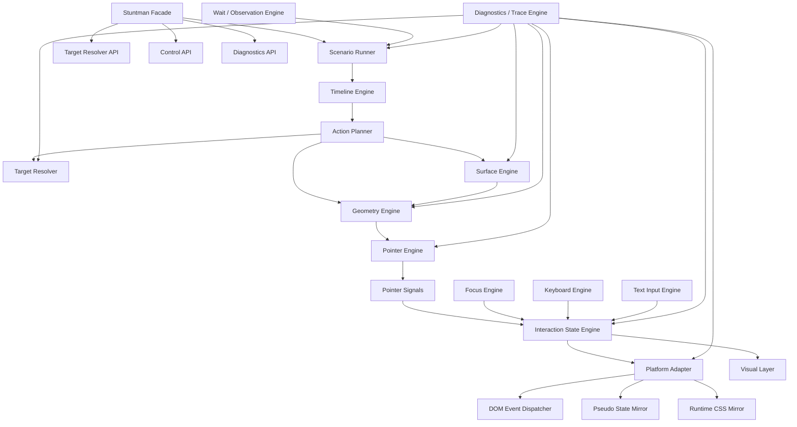
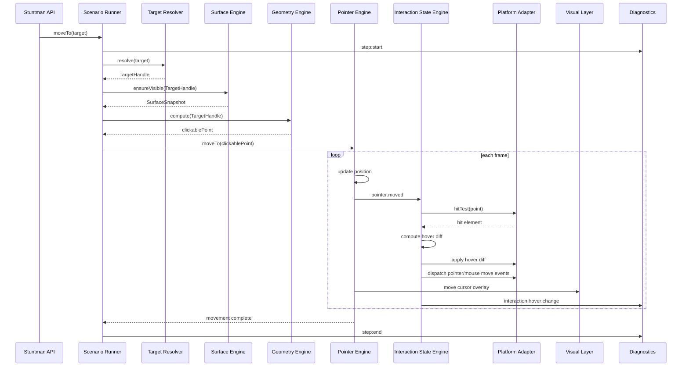
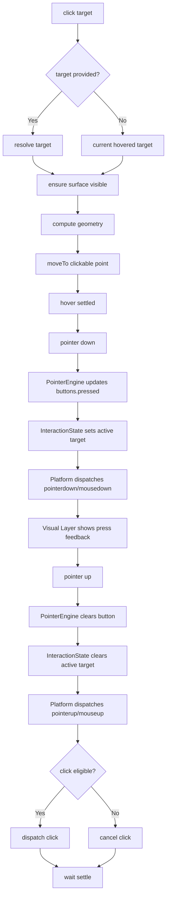
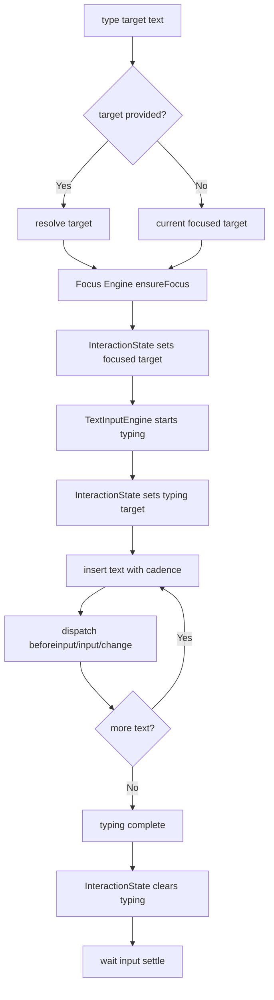

# stuntman/browser 구현체 설계 v0.2

## 1. 전체 구조



---

# 2. 모듈별 책임

## Stuntman Facade

사용자가 직접 만나는 API 계층입니다.

```ts
const stuntman = new Stuntman({
  mode: 'interactive',
  debug: true,
})

await stuntman.click(role('button', { name: 'Create Project' }))
```

담당:

```txt
- public API 제공
- run / pause / resume / stop / destroy
- resolve / geometry 같은 디버깅 친화 API 노출
- 내부 엔진 orchestration
```

---

## Target Resolver

**무엇을 조작할지 찾는 엔진**입니다.
외부 API로 노출합니다.

```ts
const button = await stuntman.resolve(
  role('button', { name: 'Create Project' })
)

const candidates = await stuntman.resolveAll(text('Create'))
```

담당:

```txt
- css / role / text / label / testId / point / element locator 처리
- 후보 ranking
- ambiguous target 감지
- target debug info 생성
- stale target 검증
```

추천 API:

```ts
stuntman.resolve(locator)
stuntman.resolveAll(locator)
stuntman.exists(locator)
stuntman.resolveDebug(locator)
```

---

## Surface Engine

**어느 공간에서 조작하는지 관리하는 엔진**입니다.

브라우저에서 surface는 단순 viewport만이 아닙니다.

```txt
- top-level viewport
- scroll container
- iframe viewport
- shadow root boundary
- dialog
- popover
- modal
- fixed layer
```

담당:

```txt
- active surface 관리
- scroll container chain 계산
- target을 보이게 만들기
- viewport / document / iframe / shadow root 좌표 변환
- clipping 영역 계산
- target이 현재 surface 안에 보이는지 판단
```

`ScrollEngine`은 따로 두기보다 Surface Engine의 하위 책임으로 둡니다.

```ts
class SurfaceEngine {
  getSurfaceFor(target: TargetHandle): SurfaceSnapshot
  getScrollableAncestors(target: TargetHandle): Element[]
  ensureVisible(target: TargetHandle, options?: RevealOptions): Promise<void>
  scrollTo(targetOrPosition: TargetLike | ScrollPosition): Promise<void>
  mapPoint(point: Point, from: CoordinateSpace, to: CoordinateSpace): Point
}
```

---

## Geometry Engine

**target이 어디에 있고, 어디를 눌러야 하는지 계산하는 엔진**입니다.

담당:

```txt
- bounding rect 계산
- visible rect 계산
- clickable point 계산
- target visibility 판단
- occlusion 판단
- pointer-events / display / visibility / disabled / inert 체크
```

예상 API:

```ts
const geometry = await stuntman.geometry(button)

geometry.rect
geometry.visibleRect
geometry.clickablePoint
geometry.occluded
geometry.visibilityRatio
```

타입 예시:

```ts
type GeometrySnapshot = {
  target: TargetHandle

  rect: Rect
  visibleRect: Rect | null
  center: Point
  clickablePoint: Point | null

  visible: boolean
  visibilityRatio: number
  occluded: boolean
  occludingElement?: Element

  coordinateSpace: 'viewport'
  computedAt: number
}
```

---

## Pointer Engine

**좌표와 포인터의 물리적 움직임을 관리하는 엔진**입니다.

여기서 최종적으로 정리된 핵심은:

```txt
PointerEngine은 hover/active/dragging을 소유하지 않는다.
PointerEngine은 position, motion, buttons만 소유한다.
```

### PointerState

```ts
type PointerState = {
  id: string

  position: Point
  previousPosition: Point | null

  motion: PointerMotionState

  buttons: PointerButtonState

  surface: {
    id: string | null
    coordinateSpace: CoordinateSpace
  }
}

type PointerMotionState = {
  status: 'idle' | 'moving' | 'settling' | 'cancelled'

  from?: Point
  to?: Point

  startedAt?: number
  updatedAt?: number

  path?: PointerPath
}

type PointerButtonState = {
  pressed: Set<PointerButton>
  primary: PointerButton | null

  lastDownAt?: number
  lastUpAt?: number
}
```

여기서 `motion.status`는 포인터 이동 자체의 상태입니다.

```txt
idle
= 움직이지 않음

moving
= 경로를 따라 이동 중

settling
= 이동은 끝났지만 후속 상태 반영 중

cancelled
= 이동 중단됨
```

포인터가 어떤 요소 위에 있는지, 어떤 요소를 누르고 있는지는 여기서 관리하지 않습니다.

---

## Pointer Signals

Pointer Engine은 직접 DOM event를 쏘지 않고 signal을 냅니다.

```ts
type PointerSignal =
  | {
      type: 'pointer:moved'
      point: Point
      previousPoint: Point | null
    }
  | {
      type: 'pointer:down'
      point: Point
      button: PointerButton
    }
  | {
      type: 'pointer:up'
      point: Point
      button: PointerButton
    }
  | {
      type: 'pointer:cancelled'
    }
```

이 signal을 Interaction State Engine이 해석합니다.

---

## Interaction State Engine

**포인터/키보드/포커스가 UI와 맺는 관계 상태를 관리하는 엔진**입니다.

담당:

```txt
- hovered target
- hover chain
- active target
- focused target
- focus-visible target
- typing target
- drag source / drop target
- current interaction diff
```

### InteractionState

```ts
type BrowserInteractionState = {
  hovered: {
    target: TargetHandle | null
    chain: TargetHandle[]
    previous: TargetHandle | null
  }

  active: {
    target: TargetHandle | null
    button: PointerButton | null
    startedAt: number | null
  }

  focused: {
    target: TargetHandle | null
    previous: TargetHandle | null
  }

  focusVisible: {
    target: TargetHandle | null
    modality: 'keyboard' | 'pointer' | 'programmatic'
  }

  typing: {
    active: boolean
    target: TargetHandle | null
  }

  dragging: {
    active: boolean
    source: TargetHandle | null
    currentDropTarget: TargetHandle | null
  }
}
```

정리하면:

```txt
PointerEngine
- x/y
- path
- movement
- button pressed 여부

InteractionStateEngine
- 이 좌표가 어떤 target을 hover하는가
- 어떤 target이 active인가
- 어떤 target이 focused인가
- typing/dragging 중인가
```

---

# 3. 상태 소유권 최종 정리

```txt
Target Resolver
- target handle
- candidate list
- locator matching
- ambiguity

Surface Engine
- surface
- scroll container
- coordinate space
- viewport / iframe / shadow root boundary

Geometry Engine
- rect
- visible rect
- clickable point
- occlusion
- visibility

Pointer Engine
- position
- previous position
- motion.status
- motion path
- pressed buttons

Interaction State Engine
- hovered target
- active target
- focused target
- focus-visible target
- typing target
- drag source/drop target

Timeline Engine
- current step
- elapsed time
- pause/resume/cancel
- animation frame scheduling

Platform Adapter
- DOM event dispatch
- attribute mutation
- native focus call
- CSS mirror application

Visual Layer
- cursor overlay
- highlight
- click ripple
- keystroke overlay
- mask/spotlight

Diagnostics Engine
- traces
- errors
- snapshots
- debug events
```

---

# 4. `moveTo(target)` 최종 흐름



여기서 중요한 점:

```txt
PointerEngine은 pointer:moved만 발생시킨다.
InteractionStateEngine이 hit-test 결과를 기반으로 hover 상태를 계산한다.
```

---

# 5. `click(target)` 최종 흐름



---

# 6. `type(target, text)` 최종 흐름



---

# 7. Browser Platform Adapter

브라우저에 실제 반영하는 계층입니다.

담당:

```txt
- elementFromPoint hit-test
- DOM pointer/mouse event dispatch
- keyboard/input event dispatch
- element.focus()
- data-stuntman-* attribute 적용
- Runtime CSS Mirror 연결
```

예상 형태:

```ts
class BrowserPlatformAdapter {
  hitTest(point: Point): Element | null

  dispatchPointerMove(signal: PointerSignal, target: Element): void
  dispatchPointerDown(signal: PointerSignal, target: Element): void
  dispatchPointerUp(signal: PointerSignal, target: Element): void
  dispatchClick(target: Element, point: Point): void

  applyHoverState(elements: Element[]): void
  applyActiveState(element: Element | null): void
  applyFocusVisibleState(element: Element | null): void

  focus(element: HTMLElement, options?: FocusOptions): void
}
```

---

# 8. Pseudo State Mirror

브라우저 구현체의 핵심 기능 중 하나입니다.

목표:

```txt
:hover / :active / :focus-visible을 런타임에서 stuntman state와 연결한다.
```

기본 attribute:

```txt
data-stuntman-hover
data-stuntman-hover-target
data-stuntman-active
data-stuntman-focus-visible
data-stuntman-focus
data-stuntman-dragging
```

예:

```css
.button:hover {
  background: #eee;
}

.button:active {
  transform: scale(0.98);
}
```

런타임 mirror:

```css
.button[data-stuntman-hover] {
  background: #eee;
}

.button[data-stuntman-active] {
  transform: scale(0.98);
}
```

모듈:

```txt
StyleSheetScanner
- document.styleSheets 스캔

SelectorRewriter
- :hover → [data-stuntman-hover]
- :active → [data-stuntman-active]
- :focus-visible → [data-stuntman-focus-visible]

MirrorStyleInjector
- style 태그 또는 adoptedStyleSheets로 주입

PseudoStateMirror
- InteractionState diff를 DOM attribute로 반영
```

---

# 9. Diagnostics / Trace 설계

초기부터 들어가야 합니다.

## Debug events

```txt
scenario:start
scenario:end
step:start
step:end
step:error

target:resolve:start
target:resolve:end
target:resolve:ambiguous
target:resolve:failed

surface:resolved
surface:scrolled

geometry:computed
geometry:occluded

pointer:move:start
pointer:move:tick
pointer:move:end
pointer:down
pointer:up

interaction:hover:change
interaction:active:change
interaction:focus:change
interaction:typing:start
interaction:typing:end

pseudo:mirror:apply
pseudo:mirror:clear

event:dispatch

wait:start
wait:retry
wait:success
wait:timeout
```

## Error codes

```txt
TARGET_NOT_FOUND
TARGET_AMBIGUOUS
TARGET_NOT_VISIBLE
TARGET_OBSCURED
GEOMETRY_UNAVAILABLE
SURFACE_UNAVAILABLE
UNSUPPORTED_TARGET
UNSUPPORTED_INPUT
WAIT_TIMEOUT
ACTION_CANCELLED
EVENT_BLOCKED
PSEUDO_MIRROR_FAILED
```

에러는 반드시 context를 포함해야 합니다.

```ts
type StuntmanErrorContext = {
  stepIndex?: number
  action?: string

  locator?: Locator
  candidates?: TargetDebugInfo[]

  resolvedTarget?: TargetDebugInfo
  geometry?: GeometrySnapshot

  pointer?: PointerState
  interaction?: BrowserInteractionState

  elapsedMs?: number
  timeoutMs?: number
}
```

---

# 10. 최종 public API

```ts
class Stuntman {
  resolve(locator: Locator): Promise<TargetHandle>
  resolveAll(locator: Locator): Promise<TargetHandle[]>
  exists(locator: Locator): Promise<boolean>
  geometry(target: TargetLike): Promise<GeometrySnapshot>

  moveTo(target: TargetLike, options?: MoveOptions): Promise<void>
  click(target?: TargetLike, options?: ClickOptions): Promise<void>
  doubleClick(target?: TargetLike, options?: ClickOptions): Promise<void>

  focus(target: TargetLike, options?: FocusOptions): Promise<void>
  type(targetOrText: TargetLike | string, textOrOptions?: string | TypeOptions): Promise<void>
  press(keys: string, options?: PressOptions): Promise<void>

  scrollTo(targetOrPosition: TargetLike | ScrollPosition, options?: ScrollOptions): Promise<void>
  drag(from: TargetLike, to: TargetLike, options?: DragOptions): Promise<void>

  waitFor(condition: WaitCondition, options?: WaitOptions): Promise<void>

  run(scenario: Scenario): Promise<void>
  pause(): void
  resume(): void
  stop(): void
  destroy(): void

  on(event: DebugEventName, listener: Listener): void
  off(event: DebugEventName, listener: Listener): void
  getTrace(): Trace
}
```

---

# 11. 최종 설계 원칙

```txt
1. Target Resolver는 외부 API로 노출한다.

2. ScrollEngine이 아니라 SurfaceEngine을 둔다.

3. GeometryEngine은 target의 공간 정보를 계산한다.

4. PointerEngine은 position, motion, buttons만 소유한다.

5. PointerState에는 phase 대신 motion.status를 둔다.

6. InteractionStateEngine은 hover, active, focus, typing, dragging 같은 의미 상태를 소유한다.

7. Hover는 move transition에서 파생된다.

8. Focus는 가능하면 native focus를 사용한다.

9. Pseudo state는 native 우선, 불가능하면 runtime mirror를 사용한다.

10. Visual Layer는 Interaction State를 표현하지만, 실제 상태와 분리된다.

11. Platform Adapter는 DOM/CSSOM/Event 호출을 격리한다.

12. Diagnostics/Trace는 초기부터 전 모듈에 걸쳐 설계한다.
```
