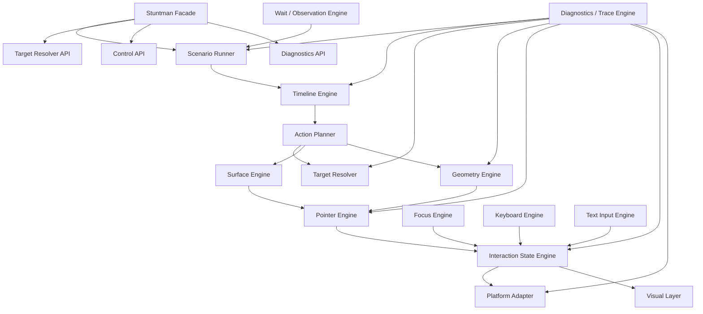
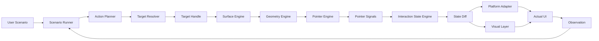
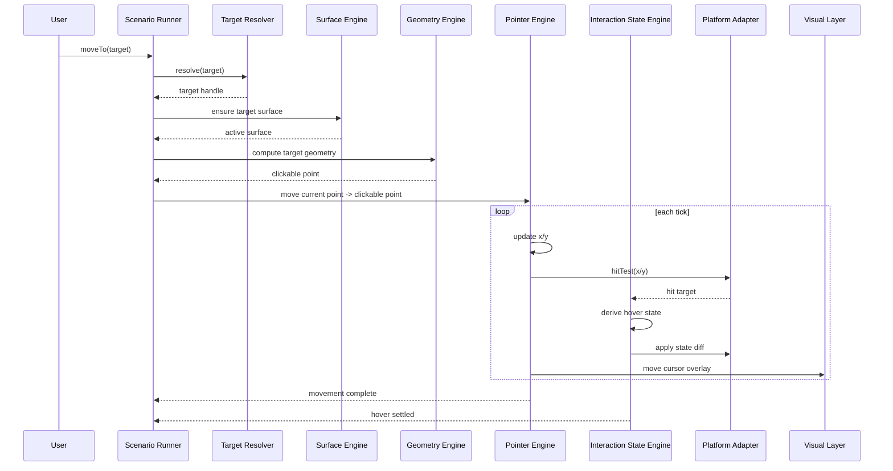
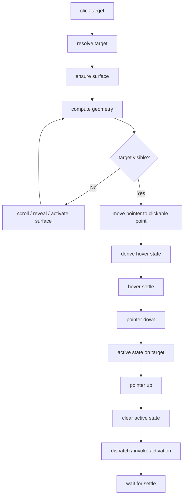

# 1. 최종 상위 구조



---

# 2. 엔진별 최종 책임

## Stuntman Facade

사용자가 직접 만나는 진입점입니다.

```ts
const stuntman = new Stuntman()

await stuntman.moveTo(target)
await stuntman.click()
await stuntman.type('hello')
await stuntman.press('Enter')
await stuntman.waitFor(target)
```

담당:

```txt
- public API 제공
- 내부 엔진 orchestration
- run / pause / resume / stop / destroy
- debug / trace API 노출
```

---

## Target Resolver

**무엇을 조작할지 찾는 엔진**입니다.
외부 API로 노출하는 게 좋습니다.

```ts
const button = await stuntman.resolve(
  role('button', { name: 'Create Project' })
)

const inputs = await stuntman.resolveAll(label('Project name'))
```

담당:

```txt
- role / text / label / selector / coordinate 기반 target 탐색
- ambiguous target 처리
- target debug 정보 제공
- waitFor와 연동
```

---

## Surface Engine

**어느 공간에서 조작하는지 관리하는 엔진**입니다.

브라우저라면 viewport, scroll container, modal, iframe 같은 개념이고,
desktop이라면 screen, window, application surface 같은 개념입니다.

담당:

```txt
- 현재 active surface 관리
- viewport/window/screen 좌표계 변환
- target이 보이는 surface 판단
- target이 안 보이면 scroll / window focus / surface activation 결정
- clipping / visibility 판단
```

---

## Geometry Engine

**target이 어디에 있고, 어디를 향해 움직여야 하는지 계산하는 엔진**입니다.

담당:

```txt
- target bounding rect
- visible rect
- center point
- clickable point
- target이 가려졌는지 판단
- target이 현재 surface 안에 보이는지 판단
- pointer가 이동할 anchor point 계산
```

예:

```ts
const geometry = await stuntman.geometry(button)

geometry.clickablePoint
geometry.visibleRect
geometry.occluded
```

---

## Pointer Engine

**포인터의 물리적 상태와 움직임을 관리하는 엔진**입니다.

여기서 좌표를 관리합니다.

담당:

```txt
- current pointer position
- previous pointer position
- pointer path
- easing
- duration
- pointer button state
- pointer down / up
- drag movement
- cursor movement signal emit
```

PointerEngine이 직접 hover를 소유하지는 않습니다.

대신 이런 signal을 냅니다.

```txt
pointer:moved
pointer:down
pointer:up
pointer:drag-start
pointer:drag-move
pointer:drag-end
```

---

## Interaction State Engine

**현재 stuntman이 UI와 어떤 관계에 있는지 관리하는 엔진**입니다.

담당:

```txt
- hovered target
- previous hovered target
- hover chain
- active target
- focused target
- focus-visible target
- typing target
- drag source
- drop target
- interaction phase
```

중요한 기준:

```txt
좌표 자체
→ PointerEngine

좌표가 UI에 대해 갖는 의미
→ InteractionStateEngine
```

예:

```txt
pointer.x = 410, pointer.y = 262
→ PointerEngine

그 좌표 아래 Create Project 버튼이 hovered 상태다
→ InteractionStateEngine
```

---

## Focus Engine

**focus를 만들고 관리하는 엔진**입니다.

담당:

```txt
- target focus
- blur
- previous focus tracking
- focus-visible 유도
- type 전 focus 확보
- Tab 이동 처리
```

FocusEngine은 실제 focus action을 수행하고, 그 결과 상태는 InteractionStateEngine에 반영합니다.

---

## Keyboard Engine

**키보드 입력 장치 수준의 action을 관리하는 엔진**입니다.

담당:

```txt
- keyDown
- keyUp
- press
- shortcut
- modifier key
```

예:

```ts
await stuntman.press('Meta+K')
await stuntman.press('Escape')
await stuntman.press('Enter')
```

---

## Text Input Engine

**문자 입력을 관리하는 엔진**입니다.

KeyboardEngine과 분리하는 게 좋습니다.

담당:

```txt
- text insertion
- typing cadence
- selection handling
- input/change event
- composition/IME 고려
- controlled input 대응
```

예:

```ts
await stuntman.type('stuntman')
```

내부적으로는:

```txt
ensure focus
→ typing state start
→ insert text
→ input settle
→ typing state end
```

---

## Timeline Engine

**시간 기반 실행을 관리하는 엔진**입니다.

담당:

```txt
- step scheduling
- duration
- easing
- animation frame / tick
- pause / resume
- cancellation
- timeout
```

stuntman은 단순 자동화가 아니라 “시간에 따른 상호작용 연출”이므로 Timeline은 1급입니다.

---

## Wait / Observation Engine

**UI가 원하는 상태가 될 때까지 기다리는 엔진**입니다.

담당:

```txt
- target visible
- target hidden
- text appears
- focus changed
- layout stable
- animation settled
- custom condition
- timeout
```

예:

```ts
await stuntman.waitFor(text('Project created'))
```

---

## Visual Layer

**사용자에게 보이는 보조 시각 효과를 담당하는 계층**입니다.

담당:

```txt
- cursor overlay
- target highlight
- click ripple
- keystroke overlay
- focus ring
- spotlight
- mask
- hide/show
```

Visual Layer는 실제 Interaction State와 분리되어야 합니다.

```txt
Interaction State
= 실제 UI와의 관계

Visual Layer
= 그 관계를 사용자에게 보여주는 표현
```

---

## Platform Adapter

**각 환경의 실제 API와 연결되는 계층**입니다.

```txt
Browser
→ DOM / CSSOM / Event Dispatch

macOS
→ Swift / Accessibility / Native Input / Overlay Window

Windows
→ UI Automation / SendInput / Native Overlay

Linux
→ AT-SPI / X11 / Wayland-specific input / Overlay
```

---

## Diagnostics / Trace Engine

초기부터 반드시 넣는 게 좋습니다.

담당:

```txt
- step trace
- target resolution trace
- geometry snapshot
- pointer path 기록
- interaction state diff
- emitted platform effect 기록
- wait retry 기록
- error context
```

---

# 3. 최종 데이터 흐름



---

# 4. `moveTo(target)` 최종 흐름



---

# 5. `click(target)` 최종 흐름



---

# 6. 최종 상태 소유권

```txt
Target Resolver
- target handle
- candidate list
- target ambiguity

Surface Engine
- active surface
- coordinate space
- visibility within surface
- scroll/reveal ability

Geometry Engine
- rect
- visible rect
- clickable point
- occlusion

Pointer Engine
- x/y
- path
- velocity
- button state
- pointer phase

Interaction State Engine
- hovered target
- active target
- focused target
- focus-visible target
- typing target
- dragging source/drop target

Timeline Engine
- current step
- elapsed time
- paused/running/stopped
- cancellation

Diagnostics Engine
- trace
- errors
- warnings
- snapshots
```

---

# 7. 최종 클래스 느낌

구현 언어별로 달라도, 개념적으로는 이런 형태를 따르면 됩니다.

```ts
class Stuntman {
  targetResolver
  surfaceEngine
  geometryEngine
  pointerEngine
  focusEngine
  keyboardEngine
  textInputEngine
  interactionState
  timeline
  observer
  visualLayer
  platform
  diagnostics

  resolve(target)
  resolveAll(target)
  geometry(target)

  moveTo(target)
  click(target?)
  doubleClick(target?)
  type(targetOrText, text?)
  press(keys)
  scrollTo(targetOrPosition)
  waitFor(condition)

  run(scenario)
  pause()
  resume()
  stop()
  destroy()

  on(event, listener)
  off(event, listener)
  getTrace()
}
```
