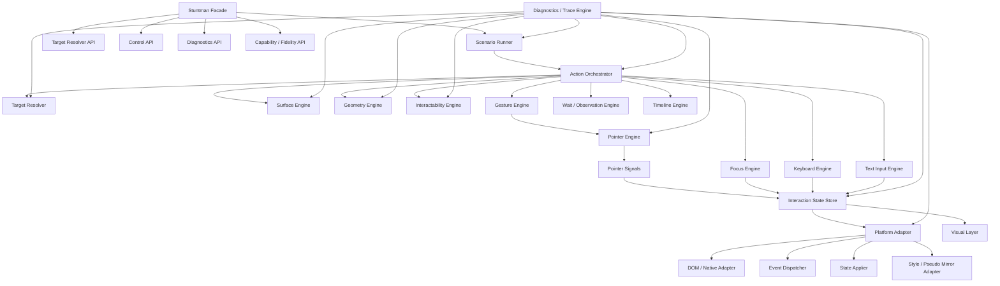
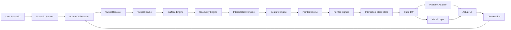
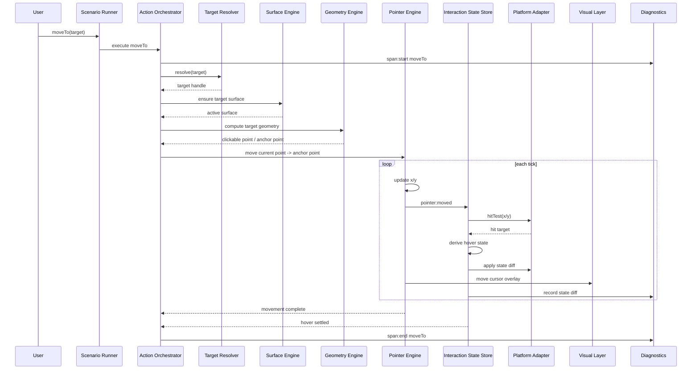
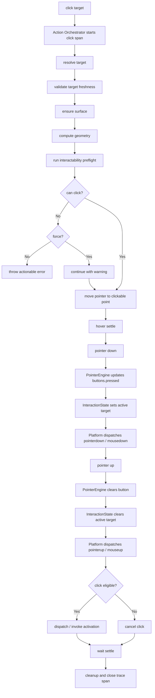

# stuntman 상위 아키텍처 설계

## 1. 최종 상위 구조



핵심 흐름은 다음과 같습니다.

```txt
Scenario
→ Action Orchestrator
→ Target / Surface / Geometry / Interactability
→ Gesture / Pointer / Focus / Keyboard / Text Input
→ Interaction State Store
→ Platform Adapter / Visual Layer
→ Observation / Settlement
```

---

## 2. 핵심 설계 원칙

```txt
1. Stuntman Facade는 사용자가 만나는 진입점이다.
2. Scenario Runner는 scenario 실행 흐름을 관리한다.
3. Action Orchestrator는 action lifecycle을 transaction처럼 관리한다.
4. Target Resolver는 외부 API로 노출한다.
5. Surface Engine은 조작이 일어나는 공간과 좌표계를 관리한다.
6. Geometry Engine은 target의 공간 정보를 계산한다.
7. Interactability Engine은 target이 실제로 조작 가능한지 판단한다.
8. Pointer Engine은 좌표, 이동, 버튼 상태만 소유한다.
9. Interaction State Store는 hover, active, focus, typing, dragging, selection 같은 의미 상태를 소유한다.
10. Visual Layer는 실제 interaction state와 분리된다.
11. Platform Adapter는 환경별 실제 API 호출을 격리한다.
12. Capability / Fidelity는 구현체의 한계를 명시한다.
13. Diagnostics / Trace는 초기부터 span 기반으로 설계한다.
```

---

## 3. Stuntman Facade

사용자가 직접 만나는 진입점입니다.

```ts
const stuntman = new Stuntman()

await stuntman.moveTo(target)
await stuntman.click(target)
await stuntman.typeInto(input, 'hello')
await stuntman.press('Enter')
await stuntman.waitFor(text('Project created'))
```

담당:

```txt
- public API 제공
- 내부 엔진 orchestration 진입점
- run / pause / resume / stop / destroy
- resolve / geometry / inspect 같은 디버깅 친화 API 노출
- capability / fidelity 정보 노출
- trace / debug API 노출
```

추천 public API:

```ts
class Stuntman {
  resolve(locator, options?)
  resolveAll(locator, options?)
  exists(locator, options?)
  inspect(target)

  geometry(target)

  moveTo(target, options?)
  click(target, options?)
  clickCurrent(options?)
  doubleClick(target, options?)

  focus(target, options?)
  type(text, options?)
  typeInto(target, text, options?)
  fill(target, text, options?)
  press(keys, options?)

  reveal(target, options?)
  scrollTo(position, options?)
  scrollBy(delta, options?)
  drag(from, to, options?)
  selectText(targetOrRange, options?)
  pointerSequence(sequence, options?)

  waitFor(condition, options?)

  run(scenario, options?)
  pause()
  resume()
  stop()
  destroy()

  getCapabilities()
  getFidelity()
  getTrace()

  on(event, listener)
  off(event, listener)
}
```

### Option model

Runtime options are part of the public contract and must be resolved at explicit
runtime boundaries instead of being interpreted ad hoc inside individual engines.

```txt
configuration input
→ centralized option defaults
→ runtime/run-level option policy
→ action-level defaults
→ step/call-level overrides
→ resolved internal options
```

Principles:

```txt
- Public option names should describe user intent, not implementation detail.
- Visual feedback and execution mode should not be split into overlapping flags.
- Motion policy should be explicit and can be disabled at runner level.
- Step/call-level options always override runner-level action defaults.
- Raw user options should not be passed deeply through engine internals.
- Engines should consume resolved internal options or narrow execution context.
```

---

## 4. Scenario Runner

Scenario Runner는 선언형 scenario를 실행 가능한 action 흐름으로 넘기는 계층입니다.

담당:

```txt
- scenario 시작/종료 관리
- step 순서 관리
- pause / resume / stop 상태 관리
- Action Orchestrator에 step 실행 위임
- scenario-level timeout / cancellation 관리
- scenario trace span 생성
```

Scenario Runner는 action 내부 세부 lifecycle을 직접 실행하지 않습니다.
개별 action의 transaction은 Action Orchestrator가 담당합니다.

---

## 5. Action Orchestrator

기존 `Action Planner`를 대체하는 핵심 실행 계층입니다.

Action Orchestrator는 `click`, `moveTo`, `typeInto`, `drag`, `selectText` 같은 user-intent action과 `pointerSequence` 같은 transactional device action을 안전한 lifecycle로 실행합니다.

담당:

```txt
- action lifecycle 관리
- resolve / reveal / geometry / preflight / perform / wait / cleanup
- cancellation-safe cleanup
- retry policy
- timeout policy
- force option 처리
- action-level trace span 생성
```

예를 들어 `click(target)`은 단일 함수처럼 보이지만 내부적으로는 다음 transaction입니다.

```txt
1. resolve target
2. validate target freshness
3. ensure target surface
4. reveal target if needed
5. compute geometry
6. run interactability preflight
7. move pointer to clickable point
8. settle hover
9. pointer down
10. active state apply
11. pointer up
12. active state clear
13. dispatch / invoke activation
14. wait for settlement
15. cleanup
```

Action Orchestrator가 있어야 다음 문제를 일관되게 처리할 수 있습니다.

```txt
- action 도중 target이 stale해진 경우
- pointer down 이후 cancel된 경우 pointer up cleanup 보장
- wait timeout 발생 시 상태 정리
- force click 허용 여부
- 실패 시 trace span과 error context 생성
```

Public action은 기본적으로 하나의 호출이 끝나면 runtime interaction state가 정리된 상태여야 합니다.
`pointerDown`, `pointerMove`, `pointerUp` 같은 열린 primitive는 Pointer Engine 내부 primitive로 유지하고,
외부로 노출해야 할 때도 Action Orchestrator가 소유하는 `pointerSequence` transaction 안에서 실행합니다.

```txt
pointerDown()
= state-opening primitive
= 호출 종료 후에도 pressed / active / capture 상태가 남을 수 있음

pointerSequence([...down, ...move, ...up])
= single public action transaction
= timeout / cancel / error 시 pointer up 또는 pointer cancel cleanup 보장
```

---

## 6. Target Resolver

**무엇을 조작할지 찾는 엔진**입니다.
외부 API로 노출합니다.

```ts
const button = await stuntman.resolve(
  role('button', { name: 'Create Project' })
)

const inputs = await stuntman.resolveAll(label('Project name'))
```

담당:

```txt
- role / text / label / selector / coordinate 기반 target 탐색
- 후보 ranking
- locator-level match index disambiguation
- ambiguous target 처리
- strict mode 지원
- target debug 정보 제공
- stale handle 검증
- waitFor와 연동
```

TargetHandle은 영구 참조가 아니라 **짧게 유효한 snapshot handle**로 봅니다.

```ts
type TargetHandle = {
  id: string
  raw: unknown
  locator?: Locator
  resolvedAt: number
  surfaceId?: string
  validity: 'live' | 'stale' | 'detached' | 'unknown'
  debug: TargetDebugInfo
}
```

모든 action 직전에는 handle을 검증해야 합니다.

```txt
validate target
→ live면 그대로 사용
→ stale이면 locator로 재resolve
→ 실패하면 TARGET_STALE 또는 TARGET_NOT_FOUND
```

`resolve` 옵션:

```ts
type ResolveOptions = {
  strict?: boolean
  timeout?: number
}
```

동작 정책:

```txt
strict: true
- 후보 0개 → TARGET_NOT_FOUND
- 후보 2개 이상 → TARGET_AMBIGUOUS

strict: false
- ranking으로 best candidate 선택
- trace에 candidate list 기록

matchIndex가 있는 locator
- base locator 후보를 먼저 ranking한다
- 0-based matchIndex에 해당하는 후보만 target으로 선택한다
- 범위를 벗어나면 후보 0개와 동일하게 처리한다
```

---

## 7. Surface Engine

**어느 공간에서 조작하는지 관리하는 엔진**입니다.

브라우저라면 viewport, scroll container, modal, iframe 같은 개념이고, desktop이라면 screen, window, application surface 같은 개념입니다.

담당:

```txt
- 현재 active surface 관리
- coordinate space 관리
- viewport / window / screen 좌표계 변환
- target이 속한 surface 확인
- target이 보이는 surface 판단
- target이 안 보이면 scroll / window focus / surface activation 결정
- scroll chain 또는 surface activation chain 제공
- clipping chain 원천 데이터 제공
```

Surface Engine은 visibility의 원천 데이터를 제공하지만, 최종적인 `visibleRect` 계산은 Geometry Engine이 담당합니다.

```txt
Surface Engine
- 어디에서 볼 것인가
- 어떤 surface에 속하는가
- 어떤 좌표계를 사용하는가
- 어떤 scroll/reveal 경로가 있는가

Geometry Engine
- 실제 rect가 어디인가
- visible rect가 얼마인가
- 클릭 가능한 지점은 어디인가
```

Target reveal과 explicit scroll은 서로 다른 public intent입니다.

```txt
reveal(target)
= target의 required visibility를 만족하도록 필요한 surface chain을 이동

scrollTo(position)
= 명시한 surface의 절대 scroll position으로 이동

scrollBy(delta)
= 명시한 surface의 현재 position에서 상대 이동
```

Surface Engine은 reveal을 lifecycle을 가진 action primitive로 제공합니다. 플랫폼 구현은
surface chain을 안쪽에서 바깥쪽으로 계획하고, 각 이동 뒤 geometry invalidation과 남은
계획의 재평가를 허용해야 합니다. Oversized target처럼 requested visibility를 달성할 수
없는 경우에는 가능한 최대 visibility를 확보하고 결과에 미달 상태를 보고합니다.

`scrollTo(target)` compatibility overload를 유지하는 구현은 deprecated alias로만 제공하며
내부적으로 `reveal(target)`에 위임합니다.

---

## 8. Geometry Engine

**target이 어디에 있고, 어디를 향해 움직여야 하는지 계산하는 엔진**입니다.

담당:

```txt
- target bounding rect
- visible rect
- center point
- clickable point 후보 계산
- coordinate space 정규화
- pointer가 이동할 anchor point 계산
```

Geometry Engine은 조작 가능성 자체를 최종 판단하지 않습니다.
`disabled`, `readonly`, `pointer-events`, `occlusion` 등은 Interactability Engine에서 판단합니다.

Geometry snapshot 예시:

```ts
type GeometrySnapshot = {
  target: TargetHandle

  rect: Rect
  visibleRect: Rect | null
  center: Point

  clickablePoint: ClickablePointResult

  coordinateSpace: CoordinateSpace
  computedAt: number
}
```

`clickablePoint`는 단순 `Point | null`보다 계산 근거를 포함해야 합니다.

```ts
type ClickablePointResult =
  | {
      ok: true
      point: Point
      strategy:
        | 'center'
        | 'visible-center'
        | 'grid-sampling'
        | 'label-control'
        | 'custom'
      hitTarget?: TargetHandle
    }
  | {
      ok: false
      reason:
        | 'not-visible'
        | 'fully-occluded'
        | 'pointer-events-none'
        | 'disabled'
        | 'outside-surface'
        | 'no-sample-hit'
      samples?: PointSample[]
    }
```

---

## 9. Interactability Engine

**target이 지금 실제로 조작 가능한지 판단하는 엔진**입니다.

Geometry가 “어디에 있는가”를 계산한다면, Interactability는 “지금 조작해도 되는가”를 판단합니다.

담당:

```txt
- visible enough
- enabled / disabled
- readonly / editable
- pointer-events
- inert
- aria-disabled
- occlusion
- receives pointer events
- focusable 여부
- editable 여부
- force option으로 우회 가능한지 판단
```

예시 타입:

```ts
type InteractabilityReport = {
  target: TargetHandle

  visible: boolean
  visibilityRatio?: number

  enabled: boolean
  editable?: boolean
  focusable?: boolean

  receivesPointerEvents: boolean
  occludedBy?: TargetDebugInfo

  canClick: boolean
  canFocus: boolean
  canType?: boolean

  blockingReasons: InteractabilityReason[]
}
```

예상 실패 메시지:

```txt
Cannot click "Create Project".
The element is visible, but its clickable point is covered by ".loading-overlay".
```

Action Orchestrator는 action 수행 전 Interactability Engine의 preflight를 통과해야 합니다.

---

## 10. Gesture Engine

Gesture Engine은 pointer 기반 composite action을 담당합니다.

담당:

```txt
- click
- doubleClick
- longPress
- drag
- hover settle
- text selection gesture
- pointer sequence
```

Gesture Engine은 Pointer Engine을 사용하지만, Pointer Engine 자체는 아닙니다.

```txt
Pointer Engine
- 좌표와 버튼 상태를 관리

Gesture Engine
- pointer signal을 조합해 click, drag 같은 고수준 제스처를 구성
```

`click(target)`은 Action Orchestrator가 lifecycle을 관리하고, 실제 pointer down/up sequence는 Gesture Engine이 수행합니다.

Text selection은 drag와 같은 pointer sequence를 사용할 수 있지만 drag의 하위 의미가 아닙니다.
`drag`는 source에서 destination으로 무언가를 옮기는 intent이고, `selectText`는 document / input / editor의 selection range를 변경하는 intent입니다.

---

## 11. Pointer Engine

**포인터의 물리적 상태와 움직임을 관리하는 엔진**입니다.

여기서 좌표를 관리합니다.

담당:

```txt
- current pointer position
- previous pointer position
- pointer path
- easing
- duration
- pointer button state
- pointer down / up
- cursor movement signal emit
```

Pointer Engine은 hover, active, dragging target을 소유하지 않습니다.

```txt
PointerEngine이 소유하는 것:
- position
- previousPosition
- motion.status
- motion path
- pressed buttons

Interaction State Store가 소유하는 것:
- hovered target
- active target
- focused target
- typing target
- dragging source/drop target
- selection anchor/focus/range
```

PointerState:

```ts
type PointerState = {
  id: string

  position: Point
  previousPosition: Point | null

  motion: PointerMotionState
  buttons: PointerButtonState

  surface: {
    id: string | null
    coordinateSpace: CoordinateSpace
  }
}

type PointerMotionState = {
  status: 'idle' | 'moving' | 'settling' | 'cancelled'

  from?: Point
  to?: Point

  startedAt?: number
  updatedAt?: number

  path?: PointerPath
}

type PointerButtonState = {
  pressed: Set<PointerButton>
  primary: PointerButton | null

  lastDownAt?: number
  lastUpAt?: number
}
```

Pointer Engine은 다음 signal을 냅니다.

```ts
type PointerSignal =
  | {
      type: 'pointer:moved'
      point: Point
      previousPoint: Point | null
    }
  | {
      type: 'pointer:down'
      point: Point
      button: PointerButton
    }
  | {
      type: 'pointer:up'
      point: Point
      button: PointerButton
    }
  | {
      type: 'pointer:cancelled'
    }
```

---

## 12. Interaction State Store

기존 `Interaction State Engine`은 하나의 거대한 class가 아니라 **state store + slice 구조**로 설계합니다.

담당:

```txt
- pointer signal 해석
- focus / keyboard / text input signal 해석
- hover / active / focus / typing / dragging 상태 관리
- previous state와 next state 비교
- state diff 생성
- Platform Adapter와 Visual Layer에 반영할 effect 생성
```

구조:

```txt
Interaction State Store
├─ hoverSlice
├─ activeSlice
├─ focusSlice
├─ focusVisibleSlice
├─ typingSlice
├─ dragSlice
├─ selectionSlice
└─ pointerCaptureSlice
```

외부에서는 하나의 snapshot으로 노출합니다.

```ts
type InteractionStateSnapshot = {
  hovered: {
    target: TargetHandle | null
    chain: TargetHandle[]
    previous: TargetHandle | null
  }

  active: {
    target: TargetHandle | null
    button: PointerButton | null
    startedAt: number | null
  }

  focused: {
    target: TargetHandle | null
    previous: TargetHandle | null
  }

  focusVisible: {
    target: TargetHandle | null
    modality: 'keyboard' | 'pointer' | 'programmatic'
  }

  typing: {
    active: boolean
    target: TargetHandle | null
  }

  dragging: {
    active: boolean
    source: TargetHandle | null
    currentDropTarget: TargetHandle | null
  }

  selection: {
    active: boolean
    target: TargetHandle | null
    anchor: SelectionEndpoint | null
    focus: SelectionEndpoint | null
    text?: string
  }
}
```

업데이트는 event/reducer 방식으로 처리합니다.

```ts
interactionStore.dispatch({
  type: 'pointer:moved',
  point,
  hitTarget,
})
```

중요한 원칙:

```txt
좌표 자체
→ Pointer Engine

좌표가 UI에 대해 갖는 의미
→ Interaction State Store
```

예:

```txt
pointer.x = 410, pointer.y = 262
→ Pointer Engine

그 좌표 아래 Create Project 버튼이 hovered 상태다
→ Interaction State Store
```

---

## 13. Focus Engine

**focus를 만들고 관리하는 엔진**입니다.

담당:

```txt
- target focus
- blur
- previous focus tracking
- focus-visible 유도
- type 전 focus 확보
- Tab 이동 처리
```

Focus 상태의 source of truth는 플랫폼의 실제 focus 상태여야 합니다.

브라우저 예시:

```txt
FocusEngine.ensureFocus(target)
→ PlatformAdapter.dom.focus(element)
→ PlatformAdapter.dom.readActiveElement()
→ InteractionStateStore.syncFocusFromPlatform()
```

즉 Focus Engine은 focus를 요청하고, Interaction State Store는 실제 platform state를 읽어 동기화합니다.

---

## 14. Keyboard Engine

**키보드 입력 장치 수준의 action을 관리하는 엔진**입니다.

담당:

```txt
- keyDown
- keyUp
- press
- shortcut
- modifier key
- keyboard modality 갱신
```

예:

```ts
await stuntman.press('Meta+K')
await stuntman.press('Escape')
await stuntman.press('Enter')
```

Keyboard Engine은 문자 입력 자체보다는 key sequence와 shortcut을 담당합니다.

---

## 15. Text Input Engine

**문자 입력을 관리하는 엔진**입니다.

Keyboard Engine과 분리합니다.

담당:

```txt
- text insertion
- typing cadence
- selection handling
- input/change event
- composition/IME 고려
- controlled input 대응
- editor adapter 연동
```

입력 전략:

```ts
type TextInputStrategy =
  | 'set-value'
  | 'insert-text'
  | 'keyboard-events'
  | 'composition'
  | 'editor-adapter'
```

권장 API:

```ts
await stuntman.type('hello')
// 현재 focused target에 사람처럼 입력

await stuntman.typeInto(input, 'hello')
// 특정 target에 focus 후 사람처럼 입력

await stuntman.fill(input, 'hello')
// 기존 값을 빠르게 대체
```

`type()`과 `fill()`은 의미가 다릅니다.

```txt
type
- 사람처럼 한 글자씩 입력
- typing cadence 적용 가능
- keyboard / input visual feedback과 잘 맞음

fill
- 기존 값을 지우고 빠르게 값 설정
- form setup / guided workflow에 적합
```

---

## 16. Timeline Engine

**시간 기반 실행을 관리하는 엔진**입니다.

담당:

```txt
- duration
- easing
- animation frame / tick
- pause / resume clock
- cancellation signal
- timeout
```

Timeline Engine은 action lifecycle 전체를 소유하지 않습니다.
Action lifecycle은 Action Orchestrator가 담당하고, Timeline Engine은 시간 기반 primitive를 제공합니다.

예:

```txt
PointerEngine.moveTo()
→ TimelineEngine.animate()
→ frame마다 position update
```

---

## 17. Wait / Observation Engine

**UI가 원하는 상태가 될 때까지 기다리는 엔진**입니다.

담당:

```txt
- target visible
- target hidden
- text appears
- focus changed
- layout stable
- animation settled
- mutation quiet
- custom condition
- timeout
```

Stability는 하나의 `settled` 상태로 합치지 않습니다.

```txt
interaction-stable
= 다음 interaction을 시작할 수 있는 최소 상태
= microtask flush + next animation frame + 필요한 target validity 확인

visual-stable
= presentation layer가 다음 장면으로 진행할 수 있는 관찰 상태
= mutation quiet + layout stable frames + scroll stable + watched target validity

scroll-stable
= 관찰 중인 scroll surface의 offset이 quiet window와 stable frame 조건을 만족
```

권장 stability contract:

```ts
type StabilityPolicy =
  | 'none'
  | 'next-frame'
  | 'interaction-stable'
  | 'visual-stable'
  | CustomStabilityPolicy

type ScrollSettlePolicy =
  | 'none'
  | 'next-frame'
  | 'scroll-stable'
  | {
      kind: 'scroll-stable'
      quietMs?: DurationMs
      stableFrames?: number
      threshold?: number
    }
```

Action option 예시:

```ts
await actorble.click(target, {
  wait: 'interaction-stable',
})

await actorble.click(target, {
  wait: visible(text('Project created')),
})
```

Wait conditions are declarative UI-state primitives. The shared vocabulary includes
visible, hidden, attached, detached, enabled, disabled, focused, text, value, attribute,
stable, URL, custom, and `all` / `any` composition. Platform implementations may report
unsupported conditions through capability or actionable errors, but must preserve timeout,
cancellation, observer disposal, and last-observed diagnostics.

Wait / Observation Engine은 Geometry cache invalidation과도 연결되어야 합니다.

```txt
- mutation
- resize
- scroll
- layout shift
- animation frame
```

---

## 18. Platform Adapter

**각 환경의 실제 API와 연결되는 계층**입니다.

```txt
Browser
→ DOM / CSSOM / Event Dispatch

macOS
→ Swift / Accessibility / Native Input / Overlay Window

Windows
→ UI Automation / SendInput / Native Overlay

Linux
→ AT-SPI / X11 / Wayland-specific input / Overlay
```

Platform Adapter는 내부적으로 책임을 나눕니다.

```txt
Platform Adapter
├─ DOM / Native Adapter
├─ Event Dispatcher
├─ State Applier
└─ Style / Pseudo Mirror Adapter
```

브라우저 예시:

```ts
platform.dom.hitTest(point)
platform.dom.focus(element)
platform.dom.readActiveElement()

platform.events.dispatchPointerDown(...)
platform.events.dispatchClick(...)

platform.selection.readSelection(...)
platform.selection.applySelection(...)
platform.selection.clearSelection(...)

platform.state.applyHover(...)
platform.state.applyActive(...)
platform.state.applyFocusVisible(...)

platform.styles.injectMirror(...)
```

Platform Adapter는 환경별 API 호출을 다른 엔진으로 새지 않게 격리합니다.

---

## 19. Pseudo State Mirror

Pseudo State Mirror는 core correctness가 아니라 **best-effort visual feature**입니다.

목표:

```txt
:hover / :active / :focus-visible 같은 pseudo state를
runtime에서 가능한 범위 안에서 stuntman state와 연결한다.
```

브라우저 예시:

```txt
:hover
→ data-stuntman-hover

:active
→ data-stuntman-active

:focus-visible
→ data-stuntman-focus-visible
```

중요한 정책:

```txt
- 실패해도 action 자체는 실패하지 않는다.
- 실패는 warning trace로 남긴다.
- 지원 범위는 Capability / Fidelity Report에 표시한다.
- 정확한 native pseudo-state fidelity가 필요하면 native-backed backend로 승격한다.
```

즉:

```txt
hover state 자체
= Interaction State Store의 core state

hover visual reproduction
= Pseudo State Mirror의 best-effort rendering
```

---

## 20. Visual Layer

**사용자에게 보이는 보조 시각 효과를 담당하는 계층**입니다.

담당:

```txt
- cursor overlay
- target highlight
- click ripple
- keystroke overlay
- focus ring
- hide/show
```

Visual Layer는 실제 Interaction State와 분리되어야 합니다.

```txt
Interaction State
= 실제 UI와의 관계

Visual Layer
= 그 관계를 사용자에게 보여주는 표현
```

중요한 원칙:

```txt
Visual Layer must be non-interactive by default.
Visual Layer must never affect target resolution or hit-testing.
```

Visual Layer는 Actorble interaction의 cursor, target, click, focus, typing 같은 debug/feedback
표현만 담당합니다. Product walkthrough의 spotlight, dimmed overlay, popover, caption, narration,
scene transition, user-takeover policy는 presentation runtime의 책임이며 Actorble core에 포함하지
않습니다.

브라우저 구현체에서는 overlay root에 기본적으로 다음이 적용되어야 합니다.

```css
[data-stuntman-overlay-root] {
  pointer-events: none;
}
```

---

## 21. Capability / Fidelity Model

stuntman은 구현체별로 가능한 기능과 fidelity를 명시해야 합니다.

특히 브라우저 in-page 구현체는 synthetic event의 한계를 가질 수 있습니다.

Fidelity 예시:

```ts
type InputFidelity =
  | 'visual-only'
  | 'synthetic-dom-events'
  | 'native-backed'
```

Capability 예시:

```ts
type CapabilityReport = {
  pointerInput: 'none' | 'visual' | 'synthetic' | 'native'
  keyboardInput: 'none' | 'synthetic' | 'native'
  textInput:
    | 'none'
    | 'set-value'
    | 'insert-text'
    | 'composition'
    | 'native'

  pseudoState: 'none' | 'mirror' | 'native'

  trustedEvents: boolean
  crossOriginFrame: boolean
  closedShadowRoot: boolean
  dragAndDrop:
    | 'none'
    | 'pointer-gesture'
    | 'html5-dnd'
    | 'custom-adapter'

  textSelection:
    | 'none'
    | 'selection-api'
    | 'pointer-gesture'
    | 'editor-adapter'
    | 'native'

  pointerSequence:
    | 'none'
    | 'transactional'

  scrolling:
    | 'none'
    | 'viewport'
    | 'nested-dom'

  reveal:
    | 'none'
    | 'scroll-into-view'
    | 'planned'

  stability:
    | 'none'
    | 'frame'
    | 'observed'
}
```

이 모델은 다음 질문에 답하기 위한 것입니다.

```txt
이 구현체는 진짜 사용자 입력처럼 동작하는가?
아니면 DOM event를 합성하는가?
hover/focus/active는 native인가, mirror인가?
drag/drop은 어느 수준까지 지원하는가?
text selection은 Selection API, pointer gesture, editor adapter 중 무엇으로 지원되는가?
low-level pointer 재생은 transaction cleanup을 보장하는가?
```

---

## 22. Diagnostics / Trace Engine

초기부터 반드시 들어가야 합니다.

담당:

```txt
- step trace
- action lifecycle trace
- target resolution trace
- geometry snapshot
- interactability report
- pointer path 기록
- interaction state diff
- emitted platform effect 기록
- wait retry 기록
- error context
- actionable error message 생성
```

Trace는 단순 event log가 아니라 span tree로 설계합니다.

```ts
type TraceSpan = {
  id: string
  parentId?: string
  name: string
  startedAt: number
  endedAt?: number
  status: 'ok' | 'error' | 'cancelled'
  input?: unknown
  output?: unknown
  events: TraceEvent[]
}
```

예시:

```txt
click(role(button, "Create Project"))
  resolve target
  validate target
  ensure visible
  compute geometry
  run interactability preflight
  move pointer
  pointer down
  pointer up
  dispatch click
  wait settled
```

권장 error code:

```txt
TARGET_NOT_FOUND
TARGET_AMBIGUOUS
TARGET_STALE
TARGET_DETACHED
TARGET_NOT_VISIBLE
TARGET_OBSCURED
TARGET_OUTSIDE_SURFACE

GEOMETRY_UNAVAILABLE
CLICK_POINT_UNAVAILABLE

UNSUPPORTED_TARGET
UNSUPPORTED_INPUT
UNSUPPORTED_CAPABILITY

INPUT_NOT_EDITABLE
INPUT_COMPOSITION_UNSUPPORTED
TEXT_SELECTION_UNSUPPORTED

POINTER_CAPTURE_CONFLICT
POINTER_SEQUENCE_INCOMPLETE
VISUAL_LAYER_HITTEST_BLOCKED

WAIT_TIMEOUT
ACTION_CANCELLED
PERMISSION_DENIED
PLATFORM_ERROR
PSEUDO_MIRROR_FAILED
```

에러에는 반드시 context를 포함합니다.

```ts
type StuntmanErrorContext = {
  scenarioName?: string
  stepIndex?: number
  action?: string

  locator?: Locator
  candidates?: TargetDebugInfo[]

  resolvedTarget?: TargetDebugInfo
  geometry?: GeometrySnapshot
  interactability?: InteractabilityReport

  pointer?: PointerState
  interaction?: InteractionStateSnapshot

  elapsedMs?: number
  timeoutMs?: number

  suggestion?: string
}
```

---

## 23. 최종 데이터 흐름



---

## 24. `moveTo(target)` 최종 흐름



---

## 25. `click(target)` 최종 흐름



---

## 26. 최종 상태 소유권

```txt
Target Resolver
- target handle
- candidate list
- locator matching
- ambiguity
- stale validation

Surface Engine
- active surface
- coordinate space
- viewport/window/screen mapping
- scroll/reveal ability
- clipping chain source

Geometry Engine
- rect
- visible rect
- center point
- clickable point candidates
- anchor point

Interactability Engine
- visible enough
- enabled / disabled
- readonly / editable
- pointer-events
- occlusion
- canClick / canFocus / canType

Pointer Engine
- x/y
- previous x/y
- motion.status
- motion path
- velocity
- button state

Interaction State Store
- hovered target
- hover chain
- active target
- focused target
- focus-visible target
- typing target
- dragging source/drop target
- selection / pointer capture state

Timeline Engine
- duration
- easing
- frame scheduling
- paused/running/stopped clock
- cancellation

Action Orchestrator
- action lifecycle
- transaction
- preflight
- retry
- timeout
- cleanup

Platform Adapter
- actual platform API calls
- event dispatch
- state apply
- style/pseudo mirror

Visual Layer
- cursor overlay
- highlight
- keystroke overlay
- interaction debug/feedback only

Diagnostics Engine
- trace span
- errors
- warnings
- snapshots
- actionable suggestions

Capability / Fidelity Reporter
- supported features
- unsupported features
- input fidelity
- pseudo-state fidelity
```

---

## 27. 최종 클래스 느낌

구현 언어별로 달라도, 개념적으로는 이런 형태를 따릅니다.

```ts
class Stuntman {
  scenarioRunner
  actionOrchestrator

  targetResolver
  surfaceEngine
  geometryEngine
  interactabilityEngine

  gestureEngine
  pointerEngine
  focusEngine
  keyboardEngine
  textInputEngine

  interactionStateStore
  timelineEngine
  waitEngine
  optionResolver

  visualLayer
  platformAdapter

  diagnostics
  capabilityReporter

  resolve(locator, options?)
  resolveAll(locator, options?)
  exists(locator, options?)
  inspect(target)
  geometry(target)

  moveTo(target, options?)
  click(target, options?)
  clickCurrent(options?)
  doubleClick(target, options?)

  focus(target, options?)
  type(text, options?)
  typeInto(target, text, options?)
  fill(target, text, options?)
  press(keys, options?)

  reveal(target, options?)
  scrollTo(position, options?)
  scrollBy(delta, options?)
  drag(from, to, options?)
  selectText(targetOrRange, options?)
  pointerSequence(sequence, options?)

  waitFor(condition, options?)

  run(scenario, options?)
  pause()
  resume()
  stop()
  destroy()

  getCapabilities()
  getFidelity()
  getTrace()

  on(event, listener)
  off(event, listener)
}
```

---

## 28. 한 줄 요약

```txt
Stuntman은 사용자의 선언형 scenario를 Action Orchestrator가 안전한 action lifecycle로 실행하고,
Target / Surface / Geometry / Interactability를 통해 조작 대상을 검증한 뒤,
Pointer / Focus / Keyboard / TextInput 신호를 Interaction State Store로 해석하고,
Platform Adapter와 Visual Layer를 통해 실제 UI와 시각적 피드백에 반영하는 cross-platform UI interaction choreography runtime이다.
```
